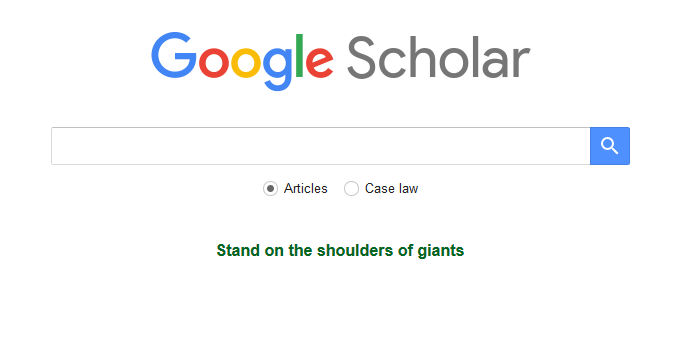

class: inverse, center, middle

```{r setup, include=FALSE}
options(htmltools.dir.version = FALSE, crayon.enabled = TRUE)

library(crayon)
library(fansi)
library(dplyr)
library(ggplot2)
library(stargazer)
library(countdown)

# data
df <- read.csv("rmd_workshop_files/images_data/journals.csv") %>% 
      mutate(subfield = as.factor(subfield), 
             english = as.factor(english),
             age = 2020 - since) %>%
      select(-since)

# regression models
lm1 <- lm(h5_index ~ issues, data = df)
lm2 <- lm(h5_index ~ issues + english, data = df)
lm3 <- lm(h5_index ~ issues + english + subfield, data = df)
lm4 <- lm(h5_index ~ issues + english + subfield + age, data = df)

```

<style type="text/css">

.hljs-github .hljs {
    background: #e5e5e5;
}

.inline-c, remark-inline-code {
   background: #e5e5e5;
   border-radius: 3px;
   padding: 4px;
   font-family: 'Source Code Pro', 'Lucida Console', Monaco, monospace;
}


.yellow-h{
   background: #ffff88;
}


.out-t, remark-inline-code {
   background: #9fff9f;
   border-radius: 3px;
   padding: 4px;
   
}

.pull-left-c {
    float: left;
    width: 58%;
    
}

.pull-right-c {
    float: right;
    width: 38%;
    
}

.medium {
    font-size: 75%
    
}

.small {
    font-size: 50%
    }

.action {
    background-color: #f2eecb;
  
}


</style>


# Writing Reproducible Research Papers with R Markdown

<br>

### Resul Umit

### November 2020

.footnote[

[Skip intro &mdash; To the contents slide](#contents-slide). &nbsp;&nbsp;&nbsp;&nbsp;&nbsp;&nbsp;&nbsp;&nbsp;&nbsp;&nbsp;&nbsp;&nbsp;&nbsp;&nbsp;&nbsp;&nbsp;&nbsp;&nbsp;&nbsp;&nbsp;&nbsp;&nbsp;&nbsp;&nbsp;&nbsp;&nbsp;&nbsp;&nbsp;&nbsp;&nbsp;&nbsp;&nbsp;&nbsp;&nbsp;&nbsp;&nbsp;&nbsp;&nbsp;&nbsp;&nbsp;&nbsp;&nbsp;&nbsp;&nbsp;&nbsp;&nbsp;&nbsp;&nbsp;&nbsp;&nbsp;&nbsp;&nbsp;&nbsp;&nbsp; <a href="mailto:resuluy@uio.no?subject=R Markdown workshop">I can teach this workshop at your institution &mdash; Email me</a>.

]

---
## Who am I?

Resul Umit

- post-doctoral researcher at the University of Oslo

- interested in representation, elections, and parliaments
    - [a recent publication](https://doi.org/10.1080/17457289.2019.1604529):
    When members of parliament disagree with their principals (country, constituency, party), how do they justify this to them?    
    
    - more at [resulumit.com](https://resulumit.com/)

---
## How did I use to write?

First, with .yellow-h[Stata + Word], I was ...

- frustrated with Word
    - formatting tables, figures, citations, and equations 
    - managing references
    
- tired of switching between programmes/screens
    - and, worried about making mistakes in between
    
- paying for programme licences

---
## How did I use to write?

Then, with .yellow-h[Stata + R + LaTeX], I was ...

- ~~frustrated with Word~~
    - ~~formatting tables, figures, citations, and equations~~ 
    - ~~managing references~~
    
- tired of switching between programmes/screens
    - and, worried about making mistakes in between
    
- paying for the Stata licence

- converting PDF documents to Word manually
    - coordinating work with co-authors who don't use LaTeX/PDF
    - submitting to journals which don't accept LaTeX/PDF

---
## How do I write now?

Now, with .yellow-h[R Markdown], I am ... happy!

- ~~frustrated with Word~~
    - ~~formatting tables, figures, citations, and equations~~ 
    - ~~managing references~~
    
- ~~tired of switching between programmes/screens~~
    - ~~and, worried about making mistakes in between~~
    
- ~~paying for the Stata licence~~

- ~~converting PDF documents to Word, manually~~
    - ~~coordinating work with co-authors who don't use LaTeX/PDF~~
    - ~~submitting to journals which don't accept LaTeX/PDF~~

---
## R Markdown

- Efficient

   - write text, cite sources, tidy data, analyse, table, and plot it in one programme/screen
   - re-do one, more, or all of these with ease
       - decrease the possibility of making mistakes in the process
       
--

- Flexible

    - output to various formats
        - e.g., HTML, LaTeX, PDF, Word
        
--

- Open access/source

   - use for free
   - create documents accessible to anyone with a computer and internet connection
   - benefit from the work of a great community of users/developers
   
---
## Reproducibilty &mdash; Before Publication

- Having written a complete draft

    - with data including re-coded variables, tables, figures, and text with references to specific results (e.g., numbers from summary and/or regression statistics)

--

- If you and/or your co-authors decide 

    - to reverse a re-coded variable to its previous/original measure
    - and/or, to exclude a subgroup of observations from analysis

--

- How resource intensive would this revision be?

    - how long would this revision take?
    - how many programmes would be needed for this revision, and how much would they cost?
    - there is an inverse relationship between this resource intensity and reproducibilty
    
---
## Reproducibilty &mdash; After Publication

- After your paper is published, if others, including your future self, would like to test how robust the results are

    - to reversing a re-coded variable to its previous/original measure
    - and/or, to excluding a subgroup of observations from analysis

--

- How resource intensive would this test be?

    - how accesible is the data, documentation (how was the variable re-coded in the first place?), and the code?
    - how long would the test take?
    - how many programmes would be needed for this revision, and how much would they cost?
    - there is an inverse relationship between this resource intensity and reproducibilty

---
## The Workshop &mdash; Overview

- Two days, on how to write reproducible research papers with R Markdown

  - 200+ slides, 40+ exercises, and time for converting a real project

--

- Based on converting a mock manuscript written in Word to R Markdown

  - plus, improving its reproducibility and version-controlling it
  - with a PDF output in mind

--

- Designed for researchers with basic knowledge of R programming language

  - does not cover programming with R
      - e.g., writing functions    
<br>
  - ability to regress, plot, and table in R will be very helpful
      - but not absolutely necessary &mdash; these skills can be developed after learning R Markdown as well
        
---
## The Workshop &mdash; Contents

.pull-left[

[Part 1. Getting the Tools Ready](#part1)
   - e.g., downloading course material

[Part 2. Introducing R Markdown](#part2)
   - e.g., creating a new document

[Part 3. Setting Metadata](#part3)
   - e.g., defining output format

[Part 4. Writing Text](#part4)
   - e.g., adding emphasis to text

[Part 5. Managing References](#part5)
   - e.g., citing sources
   
]

--
name: contents-slide

.pull-right[

[Part 6. Adding Code, Figures, and Tables](#part6)
   - e.g., plotting data

[Part 7. Addressing Functionality Gaps](#part7)
   - e.g., adjusting line spacing

[Part 8. Using Version Control](#part8)
   - e.g., integrating Git and GitHub

[Part 9. Collaborating with Others](#part9)
   - e.g., working simultaneously with co-authors

[Part 10. Working on a Real Project](#part10)
   - e.g., converting a work-in-progress of yours
   
]

---
## The Workshop &mdash; Organisation

- Sit in groups of two

  - participants learn as much from their partner as from instructors
  - switch partners after every second part

- Type, rather than copy and paste, the code that you will find on these slides

  - typing is a part of the learning process

- When you have a question

  - ask your partner
  - google together
  - ask me

---
class: action

## The Workshop &mdash; Organisation &mdash; Slides

Slides with this background colour indicate that your action is required, for

- setting the workshop up
    - e.g., downloading course material 
    
- completing the exercises
    - e.g., managing references in R Markdown
    - there are 40+ exercises
    - these slides have countdown timers
    
    
`r countdown(minutes = 3, seconds = 00, top = 0)`

---
## The Workshop &mdash; Organisation &mdash; Slides

- Codes and texts that go in R Markdown documents .inline-c[appear as such &mdash; in a different font, on gray background]
    - long codes and texts will have their own line(s)

````md
`r ''````{r, scatterplot, fig.cap = "A scatterplot of journal metrics."}

ggplot(data = df, mapping = aes(x = h5_median, y = h5_index, color = subfield)) +
       geom_point() +
       facet_wrap(. ~ branch) +
       scale_colour_discrete(name = "Journal Type", breaks = c(0, 1), labels = c("Generalist", "Subfield"))    

```
````

---
## The Workshop &mdash; Organisation &mdash; Slides

- Codes and texts that go in R Markdown documents .inline-c[appear as such &mdash; in a different font, on gray background]
    - long codes and texts will have their own line(s)

- Results that come out in output files .out-t[appear as such &mdash; in the same font, on green background]
    - except very obvious results, such as figures and tables
    
--
    
- Specific sections are .yellow-h[highlighted yellow as such] for emphasis
    - these could be for anything &mdash; codes and texts in input, results in output, and/or texts on slides
    
--

- The slides are designed for self-study as much as for the workshop
    - *accessible*, in substance and form, to go through on your own

---
## The Workshop &mdash; Aims

- To make you aware what is possible with R Markdown

  - we will cover a large breath of issues, not all of it is for long-term memory
      - one reason why the slides are designed for self study as well    
<br>
  - awareness of what is possible, `Google`, and perseverance are all we need

--

- To encourage you to convert into R Markdown 

  - practice with a mock manuscript (Parts 3&ndash;9)
  - start converting a real one (Part 10)
    
---
name: part1
class: inverse, center, middle

# Part 1. Getting the Tools Ready

.footnote[

[Back to the contents slide](#contents-slide).

]

---
## Course Materials &mdash; Overview

Materials, available at <https://github.com/resulumit/rmd_workshop/tree/materials>, have the following structure

```

rmd_workshop-materials
   |
   |- manuscript
   |  |
   |  |- reproduce_this.pdf
   |  |- journals.Rmd
   |  |- references.bib
   |  |- apa_7th.csl
   |
   |-data
   |  |
   |  |- journals.csv
   |
   |-image
   |  |
   |  |- google_scholar.png
   
   
```

---
name: download-zip
class: action

## Course Materials &mdash; Download from the Internet

- Download the materials from <https://github.com/resulumit/rmd_workshop/tree/materials>

  - on the webpage, follow

> `Code -> Download ZIP`

<br>

- Unzip and rename the folder

  - unzip to a location that is not synced
     - e.g., perhaps Documents, but not Dropbox
  
  - rename the folder as `YOURNAME-rmd`
     - e.g., `resul-rmd`
     - this will come handy in Part 9
  
---
## Course Materials &mdash; Contents

- `manuscript\reproduce_this.pdf`

    - the document, formatted in Word but saved as PDF, that we will re-create with R Markdown 
    - randomly generated sentences, with figures and tables from randomly a generated dataset<sup>*</sup>
    - key sections in-need of attention are highlighted yellow
    
.footnote[

<sup>*</sup> The text, _Lorem ipsum_, is generated with the `stringi` package (Gagolewski, 2020) while the dataset is created with the `fabricatr` package (Blair et al., 2019). 

]

---
## Course Materials &mdash; Contents

- `manuscript\reproduce_this.pdf`
    - the document, formatted in Word but saved as PDF, that we will re-create with R Markdown 
    - randomly generated sentences, with figures and tables from randomly generated dataset
    - key sections in-need of attention are highlighted

- `manuscript\journals.Rmd`
    - the R Markdown document that we will work on
    - includes unformatted text from `reproduce_this.pdf` to save time
    - major components, such as paragraphs and tables, are numbered and marked in comments to facilitate navigation

--

- `manuscript\references.bib` 

    - a BibTeX document with three fabricated references

--

- `manuscript\apa_7th.csl`

    - a Citation Style Language document, with APA (7th Edition) referencing style (Wiernik, 2020)

---
## Course Materials &mdash; Contents  

`data\journals.csv`
- a dataset created with the `fabricatr` package (Blair et al., 2019), imagined to explore the `Google Scholar` rankings of fictitious journals
    
- includes the following variables 
    - **name**: journals (1090 random titles)
    - **origin**: geographic origins (five continents)
    - **branch**: major discipline of journals (four branches)
    - **since**: time of first publication (years)
    - **h5_index**: H5 Index (integers)
    - **h5_median**: H5 Median (integers)
    - **english**: English (1) *vs.* other-language (0) journals
    - **subfield**: subfield (1) *vs.* generalist (0) journals
    - **issues**: number of issues published per year (integers)

---
## Course Materials &mdash; Contents  

- `image\google_scholar.png`

    - a screeenshot image of the [Google Scholar homapage](https://scholar.google.ch/)

---
class: action
name: install-git

## Git &mdash; Download from the Internet and Install

- For Windows, install 'Git for Windows', downloading from [https://gitforwindows.org](https://gitforwindows.org/)
       - select 'Git from the command line and also from 3rd-party software'
       
- For Mac, install 'Git', downloading from [https://git-scm.com/downloads](https://git-scm.com/downloads)

---
class: action

## GitHub &mdash; Open an Account

Sign up for GitHub at [https://github.com](https://github.com/)

- registering an account is free

- usernames are public
      - either choose an anonymous username (e.g., `asdf029348`)
      - or choose one carefully &mdash; it becomes a part of users' online presence
      
- usernames can be changed later
        
---
class: action

## R and RStudio &mdash; Download from the Internet and Install

- Download R from [https://cloud.r-project.org](https://cloud.r-project.org)
    - choose the version for your operating system

- Download RStudio from [https://rstudio.com/products/rstudio/download](https://rstudio.com/products/rstudio/download)
    - choose the free version

---
class: action

## R Packages &mdash; Install from within RStudio

```{r eval=FALSE, tidy=FALSE}
install.packages(c("rmarkdown", "tinytex", "dplyr", "stargazer", "ggplot2"))

tinytex::install_tinytex()

```

--

- `rmarkdown` (Allaire et al., 2020), for automating the process of converting R Markdown documents into other formats

---
class: action

## R Packages &mdash; Install from within RStudio

```{r eval=FALSE, tidy=FALSE}
install.packages(c("rmarkdown", "tinytex", "dplyr", "stargazer", "ggplot2"))

tinytex::install_tinytex() #<<

```

- `rmarkdown` (Allaire et al., 2020), for automating the process of converting R Markdown documents into other formats

- `tinytex` (Xie, 2020), for PDF outputs
    - requires an additional step to install
    - alternative: a TeX/LaTeX system installed on your computer

---
class: action

## R Packages &mdash; Install from within RStudio

```{r eval=FALSE, tidy=FALSE}
install.packages(c("rmarkdown", "tinytex", "dplyr", "stargazer", "ggplot2"))

tinytex::install_tinytex()

```


- `dplyr` (Wickham, 2020a), for data manipulation
    - alternatives: e.g., `base`, `data.table` (Dowle & Srinivasan, 2019)

--

- `stargazer` (Hlavac, 2018), for tables
    - alternatives: e.g., `knitr` (Xie, 2020b), `kableExtra` (Zhu, 2019)
    
--

    
- `ggplot2` (Wickham, 2020b), for figures
    - alternatives: e.g., `base`, `plotly` (Sievert et al., 2020)

---
class: action
name: rstudio-project

## RStudio Project &mdash; Create from within RStudio 

- RStudio allows for dividing your work with R into separate projects, each with own history etc.

  - [this page](https://support.rstudio.com/hc/en-us/articles/200526207-Using-Projects) has more information on why projects are recommended

<br>

- Create a new RStudio project for the existing<sup>*</sup> workshop directory `...\YOURNAME-rmd` from the RStudio menu:

> `File -> New Project -> Existing Directory -> Browse -> ...\YOURNAME-rmd -> Open`


.footnote[

<sup>*</sup> Recall that we have downloaded this earlier from GitHub. [Back to the relevant slide](#download-zip).

]

---
class: action

## R Markdown Cheat Sheet &mdash; Download from the Internet

Downloading process can be initiated from within RStudio

- follow from the RStudio menu

> `Help -> Cheatsheets -> R Markdown Cheat Sheet` 


---
## Other Resources<sup>*</sup>

- Pandoc User's Guide

   - available at [https://pandoc.org/MANUAL.html](https://pandoc.org/MANUAL.html)

- R Markdown: The Definitive Guide (Xie et al., 2019)

   - open access at [https://bookdown.org/yihui/rmarkdown](https://bookdown.org/yihui/rmarkdown/)
    

- R for Data Science (Wickham and Grolemund, 2019)
  
   - open access at [https://r4ds.had.co.nz](https://r4ds.had.co.nz/)
   
.footnote[

<sup>*</sup> During the workshop, R Markdown Cheat Sheet is likely to be more helpful than these resources, which I recommend to be consulted after the workshop.

]

---
name: part2
class: inverse, center, middle

# Part 2. Introducing R Markdown

.footnote[

[Back to the contents slide](#contents-slide).

]

---
class: action

## R Markdown Document &mdash; Create from within RStudio

- Create a new R Markdown document from the RStudio menu:<sup>*</sup> 

> `File -> New File -> R Markdown -> OK`

- Save your new document:<sup>**</sup>

> `File -> Save`

- Observe that 

    - the document has been saved to your working directory, and
    - it has the .Rmd extension

.footnote[

<sup>*</sup> This is for demonstration purposes only. Otherwise, we will work with `journals.Rmd`, which you have already downloaded, to save time.

<sup>**</sup> Alternatively, use the `Save` button or the keyboard shortcut (e.g., `Ctrl + S` on Windows). For shortcuts, follow `Tools -> Keyboard Shortcuts Help` or `Tools -> Modify Keyboard Shortcuts...`.

]

---
## R Markdown Document &mdash; Components

.pull-left-c[

Observe also that the document has three components

 - .yellow-h[YAML]
]

.pull-right-c[

]

---
## R Markdown Document &mdash; Components

.pull-left-c[

Observe also that the document has three components

 - YAML
 - .yellow-h[text]
]

.pull-right-c[


]

---
## R Markdown Document &mdash; Components

.pull-left-c[

Observe also that the document has three components

 - YAML
 - text
 - .yellow-h[code chunks]
 
]

.pull-right-c[


]

---
class: action

## R Markdown Document &mdash; Compile

.pull-left-c[
- Click the `Knit` button to compile it, and observe that 

  - the output document has the same name as your .Rmd document

- You may want to delete these newly created files, as we will work with `journals.Rmd` instead to save time. 

]

.pull-right-c[

```{r, echo = FALSE, out.width = "95%"}
knitr::include_graphics("rmd_workshop_files/images_data/first_rmd.png")
```

]

---
## R Markdown Document &mdash; Compilation Process 

- When you `Knit`, the following happens: 
> `.Rmd --knitr--> .md --pandoc--> output`

  - `knitr`<sup>*</sup> executes the code if there is any, converts the resulting document from .Rmd (R Markdown) into .md (Markdown)

  - `pandoc`<sup>**</sup> transforms the .md document into your preferred output format(s)
  
     - e.g., HTML, LaTeX, PDF, Word

- This process is automated by the `rmarkdown` package

.footnote[

<sup>*</sup> If you had not already have the `knitr` package, it would have been installed together with the `rmarkdown` package.

<sup>**</sup> RStudio comes with a copy of `pandoc` ([http://pandoc.org](http://pandoc.org)), which is not an R package, so that you do not have to install it separately. 

]

---
## R Markdown Document &mdash; Notes

- Behind the scenes, each .Rmd file is compiled in its own session, and therefore

  - the code needs to stand alone, for reproducibility reasons
  - you might have already loaded a package and/or imported data elsewhere (e.g., in a separate .R and/or .Rmd file), but even in the same session, these won't be available to a given .Rmd file

--

- R Markdown can produce more than documents,<sup>*</sup> including

  - presentations, again with `rmarkdown`
  - books, with `bookdown` (Xie, 2020c)
  - websites, with `blogdown` (Xie, 2020d)

.footnote[

<sup>*</sup> Here we will focus on research papers only. In a separate workshop, I teach how to create professional websites with R Blogdown.

]  

---
name: part3
class: inverse, center, middle

# Part 3. Setting Metadata

.footnote[

[Back to the contents slide](#contents-slide).

]

---
## YAML &mdash; Overview

.Rmd documents start<sup>*</sup> with YAML
- it includes the metadata variables
    - e.g., title, output format    
<br>    
- it is written between a pair of three hyphens .yellow-h[-]

```{r, eval = FALSE}
---
title: 
output:
---
```


.footnote[

<sup>*</sup> Technically, we can place YAML anywhere in a .Rmd document. However, it is a good practice to start with YAML so that the metadata is easly accessbile.

]

---
## YAML &mdash; Variables

- `title` and `output` are the basic variables of YAML
    - variable names are typed in lower case, followed by a colon <span style="background-color: #ffff88;">:</span>
<br>
    - the list of available variables, as well as options and sub-options for these variables, depends on the output format
       - [Pandoc User's Guide](https://pandoc.org/MANUAL.html) provides a comprehensive documentation
       - R Markdown Cheat Sheet provides a helpful list

- Typical YAML variables for an research paper:

```{r, eval = FALSE}
---
title: 
author: 
date: 
bibliography: 
csl: 
output: 
---
```

---
## YAML &mdash; Variables

Variables can take .yellow-h[strings]

```{r, eval = FALSE}
---
title: "Journals: Random Words With Random Data" #<<
output:
---
```

---
## YAML &mdash; Variables

Variables can take strings, .yellow-h[options]

```{r, eval = FALSE}
---
title: "Journals: Random Words With Random Data" 
output: pdf_document                                  #<<
---
```

---
## YAML &mdash; Variables

Variables can take strings, options, .yellow-h[sub-options]

```{r, eval = FALSE}
---
title: "Journals: Random Words With Random Data" 
output: 
    pdf_document:
        keep_tex: true                   #<<
---
```

---
## YAML &mdash; Variables

Variables can take strings, options, sub-options, and .yellow-h[code]

```{r, eval = FALSE}
---
title: "Journals: Random Words With Random Data" 
date: "`r format(Sys.Date(), '%d %B %Y')`"      #<<
output: 
    pdf_document:
        keep_tex: true                    
---
```

---
## YAML &mdash; Variables &mdash; Output Formats

.pull-left-c[

Documents as output formats include

- .yellow-h[HTML]
    
```{r, eval = FALSE}
---
title: "Journals: Random Words With Random Data" 
output: html_document #<<
---
```  
]    

.pull-right-c[

```{r, echo = FALSE, out.width = "95%"}
knitr::include_graphics("rmd_workshop_files/images_data/yaml_html.png")
```

]

---
## YAML &mdash; Variables &mdash; Output Formats

.pull-left-c[

Documents as output formats include

- HTML
- .yellow-h[LaTeX]
    
```{r, eval = FALSE}
---
title: "Journals: Random Words With Random Data" 
output: latex_document #<<
---
```  
]    

.pull-right-c[

```{r, echo = FALSE, out.width = "95%"}
knitr::include_graphics("rmd_workshop_files/images_data/yaml_latex.png")
```

]

---
## YAML &mdash; Variables &mdash; Output Formats

.pull-left[

Documents as output formats include

- HTML
- LaTeX
- .yellow-h[PDF]
    
```{r, eval = FALSE}
---
title: "Journals: Random Words With Random Data" 
output: pdf_document #<<
---
```  
]    

.pull-right-c[

```{r, echo = FALSE, out.width = "95%"}
knitr::include_graphics("rmd_workshop_files/images_data/yaml_pdf.png")
```

]

---
## YAML &mdash; Variables &mdash; Output Formats

.pull-left-c[

Documents as output formats include

- HTML
- LaTeX
- PDF
- .yellow-h[Word]
    
```{r, eval = FALSE}
---
title: "Journals: Random Words With Random Data" 
output: word_document #<<
---
```  
]    

.pull-right-c[

```{r, echo = FALSE, out.width = "95%"}
knitr::include_graphics("rmd_workshop_files/images_data/yaml_word.png")
```

]

---
## YAML &mdash; Variables &mdash; Output Formats

.pull-left[

- Documents as output formats

  - `html_document`
  - `latex_document`
  - `pdf_document`<sup>*</sup>
  - `word_document`
  - `github_document`
  - `md_document`
  - `odt_document`
  - `rtf_document`

]
    
.pull-right-c[ 

- Presentations as output formats

  - `beamer_presentation`
  - `iosslides_presentation`
  - `powerpoint_presentation`
  - `slidy_presentation`

]    

.footnote[

<sup>*</sup> For reasons of simplicity, this workshop focuses on LaTex and/or PDF outputs. Different output formats have slightly different customisations. See [Pandoc User's Guide](https://pandoc.org/MANUAL.html) and/or R Markdown Cheat Sheet.

]

---
## YAML &mdash; Strings

.pull-left-c[

Strings with special characters, such as colon, require quotation marks .yellow-h["] or .yellow-h[']

```{r, eval = FALSE}
---
title: "Journals: Random Words With Random Data" #<<
output: pdf_document                                  
---
```

]

.pull-right-c[

```{r, echo = FALSE, out.width = "95%"}
knitr::include_graphics("rmd_workshop_files/images_data/yaml_pdf.png")
```

]

---
## YAML &mdash; Strings

.pull-left-c[

Quotation marks are optional for strings without special characters

```{r, eval = FALSE}
---
title: "Journals: Random Words With Random Data" 
subtitle: A Mock Paper for an R Markdown Workshop #<<
author: Jane Doe                                  #<<
date: 4 March 2020                                #<<
output: pdf_document                                  
---
```
]

.pull-right-c[

```{r, echo = FALSE, out.width = "95%"}
knitr::include_graphics("rmd_workshop_files/images_data/yaml2.png")
```

]

---
## YAML &mdash; Strings

.pull-left-c[

The syntax .inline-c[^[footnotes_go_here]] adds footnotes to strings

```{r, eval = FALSE}
---
title: "Journals: Random Words With Random Data^[Preliminary draft. Please do not cite or circulate without permission from the author.]" #<<
subtitle: A Mock Paper for an R Markdown Workshop
author: "Jane Doe^[Department of Science, University of Random. Email: jane.doe@random.edu. Website: http://www.janedoe.com.]"                                    #<<
date: 4 March 2020                                
output: pdf_document                                    
---
```

]

.pull-right-c[

```{r, echo = FALSE, out.width = "95%"}
knitr::include_graphics("rmd_workshop_files/images_data/yaml3.png")
```

]

---
## YAML &mdash; Strings

The `bibliography` and `csl` variables take strings as well

```{r, eval = FALSE}
---
title: "Journals: Random Words With Random Data^[Preliminary draft. Please do not cite or circulate without permission from the author.]"
subtitle: A Mock Paper for an R Markdown Workshop
author: "Jane Doe^[Department of Science, University of Random. Email: jane.doe@random.edu. Website: http://www.janedoe.com.]"                                    
date: 4 May 2020 
bibliography: references.bib   #<<
csl: apa_7th.csl               #<<  
output: pdf_document                                    
---
```

---
## YAML &mdash; Strings

These strings depend on (a) where the files are located and (b) how they are named

```{r, eval = FALSE}
---
...
bibliography: references/ref_library.bib                                               #<<
csl: "C:/Users/resul/Dropbox/teaching/r_markdown/references/chicago_manual_17.csl"     #<<
...
---
```

---
## YAML &mdash; Options and Sub-Options

.pull-left-c[

Options can have sub-options

```{r, eval = FALSE}
---
title: "Journals: Random Words With Random Data^[Preliminary draft. Please do not cite or circulate without permission from the author.]"
subtitle: A Mock Paper for an R Markdown Workshop
author: "Jane Doe^[Department of Science, University of Random. Email: jane.doe@random.edu. Website: http://www.janedoe.com.]"
date: 4 March 2020  
bibliography: references.bib
csl: apa_7th.csl   
output:                   #<<
    pdf_document:         #<<
        keep_tex: true    #<<
---
```

]

.pull-right-c[

```{r, echo = FALSE, out.width = "100%"}
knitr::include_graphics("rmd_workshop_files/images_data/yaml4.png")
```

]

---
## YAML &mdash; Options and Sub-Options

.pull-left[

Options can have sub-options

```{r, eval = FALSE}
---
title: "Journals: Random Words With Random Data^[Preliminary draft. Please do not cite or circulate without permission from the author.]"
subtitle: A Mock Paper for an R Markdown Workshop
author: "Jane Doe^[Department of Science, University of Random. Email: jane.doe@random.edu. Website: http://www.janedoe.com.]"                                    
date: 4 March 2020  
bibliography: references.bib
csl: apa_7th.csl   
output:                   #<<
    pdf_document:         #<<
        keep_tex: true    #<<
---
```

]

.pull-right[

Notice that

- this specific setting, highlighted, will create multiple outputs
    - a LaTeX and a PDF document

- all but the last option (i.e., `true`) takes a colon

- options and sub-options (except the last option, again) are stepwise indented 
   - exactly with four spaces
   - the alignment between the colons for `pdf_document` and `keep_tex` is coincidental 

]

---
## YAML &mdash; R Code

.pull-left-c[

Variables can take code as well

```{r, eval = FALSE}
---
title: "Journals: Random Words With Random Data^[Preliminary draft. Please do not cite or circulate without permission from the author.]"
subtitle: A Mock Paper for an R Markdown Workshop
author: "Jane Doe^[Department of Science, University of Random. Email: jane.doe@random.edu. Website: http://www.janedoe.com.]"
date: "`r format(Sys.Date(), '%d %B %Y')`"  #<<
bibliography: references.bib
csl: apa_7th.csl   
output: pdf_document
---
```

]

.pull-right-c[

```{r, echo = FALSE, out.width = "95%"}
knitr::include_graphics("rmd_workshop_files/images_data/yaml5.png")
```

]

---
## YAML &mdash; R Code

.pull-left[

Variables can take code as well

```{r, eval = FALSE}
---
title: "Journals: Random Words With Random Data^[Preliminary draft. Please do not cite or circulate without permission from the author.]"
subtitle: A Mock Paper for an R Markdown Workshop
author: "Jane Doe^[Department of Science, University of Random. Email: jane.doe@random.edu. Website: http://www.janedoe.com.]"
date: "`r format(Sys.Date(), '%d %B %Y')`"  #<<
bibliography: references.bib
csl: apa_7th.csl   
output: pdf_document
---
```

]

.pull-right[

Notice that

- such codes can be particularly useful for variables 
    - that need frequent updates
    - and that can be automatically updated
        - e.g., `date`

- there are quotation marks around the code

- we'll cover codes in .Rmd documents later on in the workshop

]

---
## YAML &mdash; R Code

.pull-left-c[

Code and text can be combined in a string

```{r, eval = FALSE}
---
title: "Journals: Random Words With Random Data^[Preliminary draft. Please do not cite or circulate without permission from the author.]"
subtitle: A Mock Paper for an R Markdown Workshop
author: "Jane Doe^[Department of Science, University of Random. Email: jane.doe@random.edu. Website: http://www.janedoe.com.]"
date: "First version: 4 March 2020. This version: `r format(Sys.Date(), '%d %B %Y')`."  #<<
bibliography: references.bib
csl: apa_7th.csl   
output: pdf_document
---
```

]

.pull-right-c[

```{r, echo = FALSE, out.width = "95%"}
knitr::include_graphics("rmd_workshop_files/images_data/yaml6.png")
```

]

---
name: yaml-further-settings

## YAML &mdash; Some Further Settings for PDF Outputs

- `fontsize`
    - the default is `10pt`
    - the other options are `11pt` and `12pt`
    
- `linkcolor`, `urlcolor`, `citecolor`
    - the default is the colour of the text
    - the other options are white, red, green, blue, cyan, magenta, yellow

- `link-citations`
    - the default is `no`
    - the other option is `yes` &mdash; a click on an citation will take the screen to the relevant entry in the list of references

---
class: action

## Exercises

1) Open `journals.Rmd` and fill in the YAML variables for the mock paper
- take cues from `reproduce_this.pdf` and/or the slides

<br> 

2) Add and set one of the variables mentioned as [further settings for PDF outputs](#yaml-further-settings) above
- i.e., `fontsize`, `linkcolor`, `urlcolor`, `citecolor`, `link-citations`

<br>

3) Add and set a completely new variable not covered so far
-  see, for example, the R Markdown Cheat Sheet

<br>

4) `Knit` your `journals.Rmd`
- observe the outcome
    
`r countdown(minutes = 10, seconds = 00, top = 0)`

---
name: part4
class: inverse, center, middle

# Part 4. Writing Text

.footnote[

[Back to the contents slide](#contents-slide).

]

---
## Syntax &mdash; Overview

- R Markdown follows the syntax in Pandoc's Markdown 

   - for the complete rules of the syntax, see [Pandoc User's Guide](https://pandoc.org/MANUAL.html)
   - for a useful summary of the syntax, see the R Markdown Cheat Sheet

---
## Syntax &mdash; Lines

Multiple spaces on a given line are reduced to one

```{r eval = FALSE}
This is a sentence followed by four spaces.    This is another sentence on the same line.

```

.out-t[This is a sentence followed by four spaces.    This is another sentence on the same line.]

<br>

Line endings with fewer than two spaces are ignored

```{r eval = FALSE}
This is a sentence followed by one space.
This is another sentence on a new line.
```

.out-t[This is a sentence followed by one space. This is another sentence on a new line.]

---
## Syntax &mdash; Hard Brakes

Two or more spaces at the end of lines introduce hard brakes, forcing a new line

```{r eval = FALSE}
This is a sentence followed by two spaces.  
This is another sentence on a new line.
```

.out-t[This is a sentence followed by two spaces.  
This is another sentence on a new line.]
 
---
## Syntax &mdash; Line Blocks

Spaces in lines starting with a vertical line .yellow-h[|] are kept

```{r eval = FALSE}
| a one-space indent
|     a five-space indent
|          a ten-space indent  
```

.out-t[

&nbsp;a one-space indent  
&nbsp;&nbsp;&nbsp;&nbsp;&nbsp;a five-space indent  
&nbsp;&nbsp;&nbsp;&nbsp;&nbsp;&nbsp;&nbsp;&nbsp;&nbsp;&nbsp;a ten-space indent  

]

---
## Syntax &mdash; Block Quotes

Lines starting with the greater-than sign .yellow-h[&#62;] introduce block quotes

```{r, eval=FALSE}
> In God, we trust. All others must bring data. 
>
> --- Anonymous 

```

.out-t[

&nbsp;&nbsp;&nbsp;&nbsp;&nbsp;&nbsp;&nbsp;&nbsp;In God, we trust. All others must bring data.    
&nbsp;&nbsp;&nbsp;&nbsp;&nbsp;&nbsp;&nbsp;&nbsp;    
&nbsp;&nbsp;&nbsp;&nbsp;&nbsp;&nbsp;&nbsp;&nbsp; &mdash; Anonymous
]
---
## Syntax &mdash; Paragraphs

One or more<sup>*</sup> blank lines introduce a new paragraph

```{r eval = FALSE}

This is the first sentence of a paragraph as it is preceded by a blank line. This is the second 
sentence of that paragraph, which is followed by a blank line. 

This is the first sentence of a *new paragraph* as it is preceded by a blank line. This is the 
second sentence of that paragraph, which is followed by a blank line.

```

.out-t[

This is the first sentence of a paragraph as it is preceded by a blank line. This is the second 
sentence of that paragraph, which is followed by a blank line.

This is the first sentence of a *new paragraph* as it is preceded by a blank line. This is the 
second sentence of that paragraph, which is followed by a blank line.

]

.footnote[

<sup>*</sup> Multiple blank lines between paragraphs reduce to one.

]

---
## Syntax &mdash; Comments

Text with the syntax .inline-c[<!--].inline-c[comments -->] is omitted from output

```md
<!-- This paragraph needs re-writing -->
This is the first sentence of a paragraph as it is preceded by a blank line. This is the second 
sentence of that paragraph, which is followed by a blank line. 

This is the first sentence of a new paragraph <!-- I've removed italics --> as it is preceded 
by a blank line. This is the second sentence of that paragraph, which is followed by a blank 
line. 

```

.out-t[

This is the first sentence of a paragraph as it is preceded by a blank line. This is the second 
sentence of that paragraph, which is followed by a blank line.

This is the first sentence of a new paragraph as it is preceded by a blank line. This is the 
second sentence of that paragraph, which is followed by a blank line.

]

---
class: action

## Exercises

5) Hard Brakes

- see `reproduce_this.pdf`: page 1 
- apply in `journals.Rmd`: paragraph 1

<br>

6) Line Blocks / Block Quotes

- see `reproduce_this.pdf`: page 1
- apply in `journals.Rmd`: block quote, between paragraphs 1 and 2   
<br>
- see `reproduce_this.pdf`: page 5
- apply in `journals.Rmd`: hypothesis 1, between paragraphs 14 and 15; hypothesis 2, between paragraphs 16 and 17

`r countdown(minutes = 5, seconds = 00, top = 0)`  

---
## Syntax &mdash; Headers

The number sign .yellow-h[&#x23;] introduces headers; lower levels are created with additional signs &mdash; up to total five levels

.pull-left[

.inline-c[&#x23; Introduction] becomes

.out-t[

# Introduction

]

.inline-c[&#x23;&#x23; 1. Introduction] becomes

.out-t[

## 1. Introduction

]

]

.pull-right[

.inline-c[&#x23;&#x23;&#x23; 3.1 Introduction] becomes

.out-t[

### 3.1 Introduction

]

.inline-c[&#x23;&#x23;&#x23;&#x23; Introduction] becomes

.out-t[

#### Introduction

]

.inline-c[&#x23;&#x23;&#x23;&#x23;&#x23; Introduction] becomes

.out-t[

##### Introduction

]

]

---
## Syntax &mdash; Emphases 

A pair of single asterisk .yellow-h[&#42;] or underscores .yellow-h[&#95;] introduces italics

<span style="background-color: #e5e5e5; border-radius: 3px; padding: 4px; font-family: 'Source Code Pro', 'Lucida Console', Monaco, monospace;">&#42;italics&#42;</span> becomes .out-t[*italics*]    

<span style="background-color: #e5e5e5; border-radius: 3px; padding: 4px; font-family: 'Source Code Pro', 'Lucida Console', Monaco, monospace;">&#95;italics&#95;</span> becomes .out-t[*italics*] as well

<br>

A pair of double asterisk or underscores introduces bold  

<span style="background-color: #e5e5e5; border-radius: 3px; padding: 4px; font-family: 'Source Code Pro', 'Lucida Console', Monaco, monospace;">&#42;&#42;bold&#42;&#42;</span> becomes .out-t[**bold**]

<span style="background-color: #e5e5e5; border-radius: 3px; padding: 4px; font-family: 'Source Code Pro', 'Lucida Console', Monaco, monospace;">&#95;&#95;bold&#95;&#95;</span> becomes .out-t[**bold**] as well

<br>

These two rules can be combined

<span style="background-color: #e5e5e5; border-radius: 3px; padding: 4px; font-family: 'Source Code Pro', 'Lucida Console', Monaco, monospace;">&#42;&#42;&#95;bolditalics&#95;&#42;&#42;</span> becomes .out-t[**_bolditalics_**]

<span style="background-color: #e5e5e5; border-radius: 3px; padding: 4px; font-family: 'Source Code Pro', 'Lucida Console', Monaco, monospace;">&#95;&#42;&#42;bolditalics&#42;&#42;&#95;</span> becomes .out-t[_**bolditalics**_]  as well

---
## Syntax &mdash; Strikethrough

A pair of double tildes .yellow-h[~] introduces strikethrough

<span style="background-color: #e5e5e5; border-radius: 3px; padding: 4px; font-family: 'Source Code Pro', 'Lucida Console', Monaco, monospace;">&#126;&#126;strikethrough&#126;&#126;</span> becomes .out-t[~~strikethrough~~]

<br>

Strikethrough can be combined with italics or bold

<span style="background-color: #e5e5e5; border-radius: 3px; padding: 4px; font-family: 'Source Code Pro', 'Lucida Console', Monaco, monospace;">&#42;&#42;&#126;&#126;strikebold&#126;&#126;&#42;&#42;</span> or <span style="background-color: #e5e5e5; border-radius: 3px; padding: 4px; font-family: 'Source Code Pro', 'Lucida Console', Monaco, monospace;">&#95;&#95;&#126;&#126;strikebold&#126;&#126;&#95;&#95;</span>, they both become .out-t[**~~strikebold~~**]

<span style="background-color: #e5e5e5; border-radius: 3px; padding: 4px; font-family: 'Source Code Pro', 'Lucida Console', Monaco, monospace;">&#126;&#126;&#42;&#42;strikebold&#42;&#42;&#126;&#126;</span> or <span style="background-color: #e5e5e5; border-radius: 3px; padding: 4px; font-family: 'Source Code Pro', 'Lucida Console', Monaco, monospace;">&#126;&#126;&#95;&#95;strikebold&#95;&#95;&#126;&#126;</span>, they both become .out-t[~~**strikebold**~~] as well

<br>

<span style="background-color: #e5e5e5; border-radius: 3px; padding: 4px; font-family: 'Source Code Pro', 'Lucida Console', Monaco, monospace;">&#42;&#126;&#126;strikeitalitcs&#126;&#126;&#42;</span> or <span style="background-color: #e5e5e5; border-radius: 3px; padding: 4px; font-family: 'Source Code Pro', 'Lucida Console', Monaco, monospace;">&#95;&#126;&#126;strikeitalitcs&#126;&#126;&#95;</span>, they both become .out-t[*~~strikeitalitcs~~*] 

<span style="background-color: #e5e5e5; border-radius: 3px; padding: 4px; font-family: 'Source Code Pro', 'Lucida Console', Monaco, monospace;">&#126;&#126;&#42;strikeitalitcs&#42;&#126;&#126;</span> or <span style="background-color: #e5e5e5; border-radius: 3px; padding: 4px; font-family: 'Source Code Pro', 'Lucida Console', Monaco, monospace;">&#126;&#126;&#95;strikeitalitcs&#95;&#126;&#126;</span>, they both become .out-t[*~~strikeitalitcs~~*] as well

---
class: action

## Exercises

7) Headers

- see `reproduce_this.pdf`: pages 1 to 11
    - 11 headers, Abstract to References    
<br>    
- apply in `journals.Rmd`

<br>

8) Emphases

- see `reproduce_this.pdf`: pages 1 and 2
    - bold and italics    
<br>
- apply in `journals.Rmd`: paragraph 2

`r countdown(minutes = 3, seconds = 00, top = 0)`

---
name: internal-links

## Syntax &mdash; Links &mdash; Internal<sup>*</sup>

You can link text to section headers in the same document

<span style="background-color: #e5e5e5; border-radius: 3px; padding: 4px; font-family: 'Source Code Pro', 'Lucida Console', Monaco, monospace;">&#91;Conclusion](#conclusion)</span> becomes .out-t[[Conclusion](#internal-links)], and a click takes the screen to that section

<br>

Multi-word headers need hyphenation

<span style="background-color: #e5e5e5; border-radius: 3px; padding: 4px; font-family: 'Source Code Pro', 'Lucida Console', Monaco, monospace;">&#91;Literature Review](#literature-review)</span> becomes .out-t[[Literature Review](#internal-links)], and it works only if the second part is hyphenated

.footnote[

<sup>*</sup> The [links to references](#reference-links), [figures](#autoref-figures), and [tables](#autoref-tables) are covered later on.

]

---
## Syntax &mdash; Links &mdash; External

You can link text to URLs

<span style="background-color: #e5e5e5; border-radius: 3px; padding: 4px; font-family: 'Source Code Pro', 'Lucida Console', Monaco, monospace;">&#91;visit my website](https&#58;//resulumit.com/)</span> becomes .out-t[[visit my website](https://resulumit.com/)]

<span style="background-color: #e5e5e5; border-radius: 3px; padding: 4px; font-family: 'Source Code Pro', 'Lucida Console', Monaco, monospace;">&#91;https&#58;//resulumit.com](https&#58;//resulumit.com/)</span> becomes .out-t[[https://resulumit.com](https://resulumit.com/)]

<span style="background-color: #e5e5e5; border-radius: 3px; padding: 4px; font-family: 'Source Code Pro', 'Lucida Console', Monaco, monospace;">&#60;https&#58;//resulumit.com></span> becomes .out-t[<https://resulumit.com>] as well

--

<br>

You can also link text to an email address

<span style="background-color: #e5e5e5; border-radius: 3px; padding: 4px; font-family: 'Source Code Pro', 'Lucida Console', Monaco, monospace;">&#91;email me](mailto&#58;resuluy@uio.no)</span><sup>*</sup> becomes .out-t[[email me](mailto:resuluy@uio.no)]

<span style="background-color: #e5e5e5; border-radius: 3px; padding: 4px; font-family: 'Source Code Pro', 'Lucida Console', Monaco, monospace;">&#60;resuluy@uio.no&#62;</span> becomes .out-t[<resuluy@uio.no>]

.footnote[

<sup>*</sup> Notice the prefix .yellow-h[mailto:] in the syntax

]

---
class: action

## Exercises

9) Links &mdash; Internal

- see `reproduce_this.pdf`: page 2 
      - the link to the Literature Review section    
<br>
- apply in `journals.Rmd`: paragraph 4

<br>

10) Links &mdash; External

- see `reproduce_this.pdf`: page 1
    - email and website links in one of the footnotes    
<br>
- apply in `journals.Rmd`: title page items
  
`r countdown(minutes = 3, seconds = 00, top = 0)`  

---
## Syntax &mdash; Equations

Inline equations go between a pair of single dollar signs <span style="background-color: #ffff88;">&#x24;</span> &mdash; with no space between the signs and the equation itself

.inline-c[$E = mc^{2}$] becomes .out-t[*E = mc<sup>2</sup>*]

<br>

--

Block equations go in between a pair of double dollar signs &mdash; with or without spaces, it works

.inline-c[&#x24;&#x24;  E = mc^{2}].inline-c[&#x24;&#x24;] becomes


.out-t[

<center> <i> E = mc<sup>2</sup> </i> </center>

]


<br>


.inline-c[$$E = mc_{2}].inline-c[$$] becomes

.out-t[
<center> <i> E = mc<sub>2</sub> </i> </center>
]

---
## Syntax &mdash; Footnotes &mdash; Inline Notes

For inline footnotes, use the .inline-c[^[footnote]] syntax

.inline-c[Jane Doe^[Corresponding author.]] becomes .out-t[Jane Doe<sup>1</sup>]

<br>

.footnote[

.out-t[<sup>1</sup> Corresponding author.]

]

--

Notice that 

- the caret sign .yellow-h[^] comes .yellow-h[before] the left square bracket .yellow-h[&#91;]
- this syntax works in YAML as well as in text
    - footnotes in YAML get symbols, in text they get numbers

---
## Syntax &mdash; Footnotes &mdash; Notes with Identifiers

An alternative is to use the .inline-c[[^identifier]] syntax, with identifiers defined elsewhere in the same document

```{r eval = FALSE}
Dr Doe holds a PhD in rock science.[^defence_date]

[^defence_date]: She defended her thesis in 2017.
```

.out-t[Dr Doe holds a PhD in rock science.<sup>1</sup>] 
   
<br>

.footnote[

.out-t[<sup>1</sup> She defended her thesis in 2017.]

]

--

Notice that 

- the caret sign comes .yellow-h[after] the left square bracket
- this syntax works in text, but not in YAML

---
class: action

## Exercises

11) Equations

- see `reproduce_this.pdf`: page 7 
- apply in `journals.Rmd`: paragraph 22; block equation, between paragraphs 22 and 23

<br> 

12) Footnotes

- see `reproduce_this.pdf`: page 2 
- apply in `journals.Rmd`: paragraph 3

`r countdown(minutes = 3, seconds = 00, top = 0)`  

---
## Syntax &mdash; Lists

Lines starting with asterisk .yellow-h[&#42;] as well as plus .yellow-h[&#43;] or minus .yellow-h[&#8722;] signs introduce lists

```{r eval=FALSE}
- books
- articles
- reports
```

.out-t[

- books
- articles
- reports

]

---
## Syntax &mdash; Lists &mdash; Nesting

Lists can be nested within each other, with indentation

```{r eval=FALSE}
+ books
+ articles
    - published
    - under review
        + revised and resubmitted
    - work in progress
```

.out-t[

+ books
+ articles
    - published
    - under review
        + revised and resubmitted
    - work in progress

]

---
## Syntax &mdash; Lists &mdash; Numbering

List items can be numbered

```{r eval=FALSE}
1. books
2. articles
    - published
    - under review
        + revised and resubmitted
    - work in progress
```

.out-t[

1. books
2. articles
    - published
    - under review
        + revised and resubmitted
    - work in progress

]

---
## Syntax &mdash; Dashes

Two hyphens grouped together introduce an en-dash

.inline-c[&#8208;&#8208;] becomes .out-t[&ndash;]

<br>

Three hyphens grouped together introduce an em-dash

.inline-c[&#8208;&#8208;&#8208;] becomes .out-t[&mdash;]

---
## Syntax &mdash; Subscript and Superscript

.pull-left[

A pair of tildes introduces subscript

.inline-c[CO&#126;2&#126;] becomes .out-t[CO<sub>2</sub>]

<br>

A pair of carets introduces superscript

.inline-c[R&#94;2&#94;] becomes .out-t[R<sup>2</sup>]

]

---
## Syntax &mdash; Sub- and Super-scripts

.pull-left[

A pair of tildes introduces subscript

.inline-c[CO&#126;2&#126;] becomes .out-t[CO<sub>2</sub>]

<br>

A pair of carets introduces subscript

.inline-c[R&#94;2&#94;] becomes .out-t[R<sup>2</sup>]

]

.pull-right[

Notice that

- the syntax here (Markdown-based) is different than the one for equations (LaTeX-based)
    - e.g., <span style="background-color: #e5e5e5; border-radius: 3px; padding: 4px; font-family: 'Source Code Pro', 'Lucida Console', Monaco, monospace;">R&#94;2&#94;</span> versus <span style="background-color: #e5e5e5; border-radius: 3px; padding: 4px; font-family: 'Source Code Pro', 'Lucida Console', Monaco, monospace;"> mc^{2}</span>


]

---
class: action

## Exercises

13) Lists

- see `reproduce_this.pdf`: page 3 
- apply in `journals.Rmd`: list, between paragraphs 10 and 11

<br>

14) Dashes

- see `reproduce_this.pdf`: page 2
- apply in `journals.Rmd`: paragraph 6

<br>

15) Sub- and Super-scripts

  - see `reproduce_this.pdf`: page 2
  - apply in `journals.Rmd`: paragraph 5

`r countdown(minutes = 3, seconds = 00, top = 0)`  

---
name: part5
class: inverse, center, middle

# Part 5. Managing References

.footnote[

[Back to the contents slide](#contents-slide).

]

---
## References &mdash; Bibliography Database

.pull-left-c[
- References are defined in .bib files
    - they follow the BibTeX format

<br>

- `pandoc` looks for a .bib file, and for the definitions therein, to process citations
    - .bib files are specified with the `bibliography` variable in YAML

<br>


- `pandoc` can process a citation only if there is a linked entry in the .bib file
    - but not all entries have to be cited

]


.pull-right-c[

```{r, echo = FALSE, out.width = "95%"}
knitr::include_graphics("rmd_workshop_files/images_data/bib.png")
```

]

---
## References &mdash; Bibliography Database &mdash; Entries

.pull-left-c[

- A BibTeX entry consists of three elements

   - a type
       - e.g., `@article`    
<br>
   - a citation-key
       - e.g., `bennett2015`    
<br>
   - a number of tags
       - e.g., `title`, `author`

- Different tags are available for different reference types
    - some tags are required, others are optional
    
]

.pull-right-c[

```{r, echo=FALSE, out.width="100%"}
knitr::include_graphics("rmd_workshop_files/images_data/bib1.png")
```

]

---
## References &mdash; Bibliography Database &mdash; Entries

- One could create entries by hand
    - this requires knowing the BibTeX format, entry types, tags, and related information about references to be cited
        - this is not efficient
    
- A good alternative is to use `Google Scholar`, which provides BibTeX entries
    - follow `cite -> BibTex` and copy
    - paste into .bib, edit if necessary, and save
    
- Some publishers and journals provide BibTeX entries on their website as well

---
## References &mdash; Style

.pull-left-c[

- Reference styles are defined in .csl files
    - files for different styles (e.g., APA) are available at [https://www.zotero.org/styles](https://www.zotero.org/styles)

<br>

- `pandoc` looks for a .csl file, and for the styles therein, to style citations and references
    - .csl files are specified with the `csl` variable in YAML
    - if unspecified, it uses a Chicago author-date format
    

<br>

- .csl files affect the style only in outputs
    - no matter which the style is used, the citation syntax in .Rmd documents remains the same
    
]

.pull-right-c[

```{r, echo=FALSE, out.width="95%"}
knitr::include_graphics("rmd_workshop_files/images_data/csl.png")
```

]

---
## References &mdash; In-text Citation Syntax &mdash; Author-Date

All citations keys take the 'at' sign .yellow-h[@] while square brackets and/or minus signs introduce variation

<br>

.inline-c[[@bennett2015]] becomes .out-t[(Bennett, 2015)] in APA 7<sup>th</sup> edition

.inline-c[@bennett2015] becomes .out-t[Bennett (2015)]

.inline-c[[-@bennett2015]] becomes .out-t[(2015)]

.inline-c[-@bennett2015] becomes .out-t[2015]

.inline-c[[@bennett2015 35]] becomes .out-t[(Bennett, 2015, p. 35)]

.inline-c[[@bennett2015 33-35]] becomes .out-t[(Bennett, 2015, pp. 33&ndash;35)]

.inline-c[[@bennett2015, ch. 1]] becomes .out-t[(Bennett, 2015, ch. 1)]

.inline-c[[@bennett2015; @gilbert2019]] becomes .out-t[(Bennett, 2015; Gilbert, 2019)]

.inline-c[[see @bennett2015, for details]] becomes .out-t[(see Bennett, 2015, for details)]

.inline-c[@bennett2015 [33-35]] becomes .out-t[Bennett (2015, pp. 33&ndash;35)]

---
## References &mdash; In-text Citation Syntax &mdash; Numerical

All citations keys take the 'at' sign .yellow-h[@] 

.inline-c[A clever sentence.[@bennett2015]] becomes .out-t[A clever sentence.<sup>[1]</sup>] in certain numerical sytles

.inline-c[A clever sentence.[@bennett2015; @gilbert2019]] becomes .out-t[A clever sentence.<sup>[1,2]</sup>]


<br>
--
Individual styles may or may not use additional information, such as page numbers

.inline-c[A clever sentence.[@bennett2015 35]] might become .out-t[A clever sentence.<sup>[1]</sup>] as well

<br>
--
Individual styles may or may not be sensitive to variation, such as square brackets

.inline-c[A clever sentence. @bennett2015] might become .out-t[A clever sentence.<sup>[1]</sup>] as well

---
## Citations &mdash; Reference List

The list of references appears after the last line of the document, with no section header 
- so that you can choose the header yourself, by ending .Rmd documents with a header of your choice

```{r eval=FALSE}
This is the last sentence of a manuscript with an APA style.

## References
```

.out-t[

This is the last sentence of a manuscript with an APA style.

### References

Bennett, S. (2015). Peanut butter and jelly. *Journal of Bone, 1*(12), 335.

Gilbert, T. (2019). Turning wine into water. In M. Albert (Ed.), *The book of ground* (pp. 124142). Antman.

]

---
name: reference-links

## References &mdash; Internal Links

For internal links from in-text citations to the reference list, set .inline-c[link-citations: yes] in YAML

- a click on these links takes the screen to the relevant entry in the list
- the `linkcolor` variable make these links explicit
    - setting this is not necessary for the links to work &mdash; the default is black
       
```{r, eval = FALSE}
---
...
bibliography: references.bib
csl: apa_7th.csl
link-citations: yes    #<<
linkcolor: blue        #<<
...
---
```

---
class: action

## Exercises

16) Add an entry to `references.bib` for the following book
- *R Markdown: The Definitive Guide* by Xie and co-authors

<br>

17) Reproduce the citations and reference list in the mock paper
- see `reproduce_this.pdf`: pages 3 and 11
- apply in `journals.Rmd`: paragraph 7 to 9

<br>

18) Change the reference style
- download the .csl file for your favourite style from [https://www.zotero.org/styles](https://www.zotero.org/styles) 
- put it into your working directory
- update the YAML variable

<br>

19) Link the citations to the reference list

`r countdown(minutes = 7, seconds = 30, top = 0)`

---
name: part6
class: inverse, center, middle

# Part 6. Adding Code, Figures, and Tables

.footnote[

[Back to the contents slide](#contents-slide).

]

---
class: center, middle

# Code, in and outside Chunks

---
## Code &mdash; Overview

Most codes go inside code chunks
- e.g., code that imports and cleans data, and/or produces tables and/or figures 

````md
`r ''````{r}

df <- read.csv("rmd_workshop_files/images_data/journals.csv") %>% 
      mutate(age = 2020 - since,
             english = factor(english),
             subfield = factor(subfield))

```
````

Codes can also go in line with text
- e.g., code that results in a single statistic

```{r, eval=FALSE, tidy=FALSE}
The average H5 Index for the journals in the dataset is \`r mean(df$h5_index)`.
```

---
## Code Chunks &mdash; Overview

- Code chunks are delimitted spaces between a pair of three backticks
    - below is an empty chunk for R code

````md
`r ''````{r}

```
````

- `r` is an option of the chunk, indicating that the code in the chunk above should be run by R
    - it could have been `python`, which we will not cover in this workshop
    - options go in a pair of curly brackets, on the same line with the first delimiter

- Chunks can be placed anywhere in .Rmd documents
    - their output, if there is any, might float around text to avoid breaking across pages

---
## Code Chunks &mdash; Labels

It is recommended to label the code chunks, which are otherwise automatically numbered
- informative labels can be helpful for navigating through error messages as well as filenames of plots and cache
    - in the example below, the chunk is labelled as `data_import`
<br>
- but note that duplicate labels lead to an error during compilation


````md
`r ''````{r, `data_import`}

df <- read_csv("data/journals.csv")

```
````

---
## Code Chunks &mdash; Options

- Code chunks take options, listed on the same line with the first delimitter, in curly brackets

    - avoid spaces around the equal sign <span style="background-color: #ffff88;">=</span> between option tags and values
        - such spaces might lead to errors    
<br>
    - in the example below, the chunk is labelled as `setup`, and and the `include` option is set to `FALSE`
        - with this option and value, nothing from this chunk will be included in the output document

````md
`r ''````{r, setup, `include=FALSE`}

```
````
<br>

- The list of options is available at <https://yihui.org/knitr/options>

    - R Markdown Cheat Sheet provides a helpful list as well


---
## Code Chunks &mdash; Options &mdash; Defaults

Options have default values

- e.g., for `echo`, the default is `TRUE`
      - `echo`: should the source code printed in the output?
      - `TRUE`: yes it should   
<br>
- therefore the following two chunks have the same function

````md
`r ''````{r}

```
````

````md
`r ''````{r, `echo=TRUE`}

```
````
---
## Code Chunks &mdash; Options &mdash; Defaults

This chunk prints two things in the output document &mdash; (a) the code and (b) the head of the data frame

````md
`r ''````{r}

head(df)

```
````

.out-t[

`head(df)`

]

<hr style="height:10px; visibility:hidden;" />

.out-t[

```{r, echo=FALSE}
head(df)
```

]

---
## Code Chunks &mdash; Options

Setting .inline-c[echo=FALSE] prevents the code from being displayed in the output document

````md
`r ''````{r ... `echo=FALSE`}

head(df)

```
````

This chunk therefore prints one thing in the output document &mdash; the head of the data frame


.out-t[

```{r, include=TRUE, echo=FALSE}
head(df)
```

]

---
## Code Chunks &mdash; Other Useful Options

Prevent the result(s) of the source code from being displayed in the output document

````md
`r ''````{r ... `results="hide"`}

head(df)

```
````

This chunk therefore prints one thing in the output document &mdash; the source code

.out-t[

`head(df)`

]

Setting .inline-c[results="asis"] passes the results as they are produced by the code &mdash; `pandoc` does not transform these. In creating tables for PDF output with the `stargazer` package, this option is a must.

---
## Code Chunks &mdash; Other Useful Options

Cache results for future compilations 

````md
`r ''````{r ... `cache=TRUE`}

```
````

--

Prevent R from running the code in the chunk altogether 

````md
`r ''````{r ... `eval=FALSE`}

```
````

--

Prevent messages and/or warnings from being displayed in the output

````md
`r ''````{r ... `error=FALSE`, `message=FALSE`, `warning=FALSE`}

```
````

---
## Code Chunks &mdash; Other Useful Options

Define the .yellow-h[actual dimensions] of figures, in inches

````md
`r ''````{r ... `fig.height=6`, `fig.width=9`}

```
````

--

Define the size of figures .yellow-h[as they appear in the output document], with `out.width` and/or `out.height`

````md
`r ''````{r ... `out.width="50%"`}

```
````

--

Define the alignment of figures &mdash; `left`, `right`, or `center`

````md
`r ''````{r ... `fig.align="center"`}

```
````

---
## Code Chunks &mdash; Other Useful Options

Define captions for figures

````md
`r ''````{r ... `fig.caption="A Scatter Plot"`}

```
````

--

Set the resolution for figures

````md
`r ''````{r ... `dpi=300`}

```
````

--

Set extra options, such as angle, that output format would accept for figures

````md
`r ''````{r ... `out.extra="angle=45"`}

```
````

---
## Code Chunks &mdash; The Setup Chunk

It is recommended to use the first code chunk for general setup, where you can

- define .yellow-h[your own defaults] for chunk options, with `knitr::opts_chunk$set()`
    - avoids repeating chunk options    
<br>
- load the necessary packages    
<br>
- import raw data

````md
`r ''````{r, setup, include=FALSE}

# `chunk option defaults`
knitr::opts_chunk$set(echo=FALSE, message=FALSE)

# `packages`
library(dplyr)
library(ggplot2)
library(stargazer)

# `data`
df_raw <- read.csv("journals.csv")

```
````

---
## Code Chunks &mdash; The Data Chunk

I recommend using the second chunk for the main operations<sup>*</sup> on raw data
- e.g., for data cleaning and other transformations
- some minor transformations could be left to lower chunks
    - e.g., capitalizing variable names for figures
        
````md
`r ''````{r, data, echo=FALSE ...}

df <- df_raw `%>%`
      `...`

```
````

.footnote[

<sup>*</sup> I will be using the pipe operator <span style="background-color: #ffff88; border-radius: 3px; padding: 4px; font-family: 'Source Code Pro', 'Lucida Console', Monaco, monospace;"><code>%>%</code></span> and other functions from the `dplyr` package for such operations in the following slides.

]


---
## Code Chunks &mdash; The Data Chunk

Transform `subfield` and `english` into factor variables
- despite being numeric &mdash; i.e., 0s and 1s &mdash; they are meant to be categorical variables

````md
`r ''````{r, data, echo=FALSE ...}

df <- df_raw `%>%`
      `mutate(subfield = as.factor(subfield),` 
             `english = as.factor(english))`

```
````

---
## Code Chunks &mdash; The Data Chunk

Create a new variable `age`, based on the existing variable `since`, to be used in regression models later on

````md
`r ''````{r, data, echo=FALSE ...}

df <- df_raw %>%
      mutate(subfield = as.factor(subfield), 
             english = as.factor(english),
             `age = 2020 - since`)

```
````
--

Drop the `since` variable, so that it won't appear in our summary statistics table later on

````md
`r ''````{r, data, echo=FALSE ...}

df <- df_raw %>%
      mutate(subfield = as.factor(subfield), 
             english = as.factor(english),
             age = 2020 - since) `%>%`
      `select(-since)`
```
````

---
## Inline Code &mdash; Overview

Code can also be incorporated in text, with the <span style="background-color: #e5e5e5; border-radius: 3px; padding: 4px; font-family: 'Source Code Pro', 'Lucida Console', Monaco, monospace;"><code>&grave;r &grave;</code></span> syntax

- unline chunks, these do not take options   
<br>
- the output document will display the result of the code
    - in the exact place of the source code   
<br>
- the result of the code will have the same formatting with the text
---
## Inline Code &mdash; Examples

```{r, eval=FALSE, tidy=FALSE}
If we multiply _pi_ by 5, we get \`r pi * 5`.

```

.out-t[If we multiply _pi_ by 5, we get `r pi * 5`.]

<hr style="height:10px; visibility:hidden;" />

```{r, eval=FALSE, tidy=FALSE}
The average H5 Index for the journals in the dataset is \`r mean(df$h5_index)`, which would 
round to \`r round(mean(df$h5_index), digits = 1)`.
```

.out-t[The average H5 Index for the journals in the dataset is `r mean(df$h5_index)`, which would round to `r round(mean(df$h5_index), digits = 1)`.]

<hr style="height:10px; visibility:hidden;" />

```{r, eval=FALSE, tidy=FALSE}
__Only \`r nrow(subset(df, english == 0))` journals__ in the dataset are published in a language
other than English.
```

.out-t[__Only `r nrow(subset(df, english == 0))` journals__ in the dataset are published in a language other than English.]

---
class: action

## Exercises

20) Setup Chunk
- introduce a setup chunk with one or more defaults chunk options, with `knitr::opts_chunk$set()`
- load the packages that we will need &mdash; `dplyr`, `ggplot2`, and `stargazer`
- import raw data

<br>

21) Data Chunk
- introduce a data chunk to transform `subfield` and `english` into factors
- create a new variable `age`, based on `since`
- drop `since` from the data frame

<br>

22) Inline code

- see `reproduce_this.pdf`: page 6
    - i.e., 1091 observations    
<br>    
- apply in `journals.Rmd`: paragraph 21
    - hint: use the `nrow` function
  
`r countdown(minutes = 7, seconds = 30, top = 0)`  

---
class: center, middle

# Figures

---
## Figures &mdash; Images &mdash; Markdown Syntax

The syntax <span style="background-color: #e5e5e5; border-radius: 3px; padding: 4px; font-family: 'Source Code Pro', 'Lucida Console', Monaco, monospace;">!&#91;Figure Caption&#93;(figure.extension)</span> embeds images, and/or figures produced elsewhere,<sup>*</sup> into .Rmd documents
 
- similar to the link syntax, only this time it is preceded by an exclamation mark .yellow-h[!]
- goes outside code chunks, on a new line
- simple, but not very customisable
    
.footnote[

<sup>*</sup> Ideally, reproducible papers should produce their own images with data and code. However, there might be situations where this is not possible.

]

---
## Figures &mdash; Images &mdash; Markdown Syntax

```{r, eval=FALSE}

```

```{r, echo=FALSE, fig.align="center", out.width="65%"}

knitr::include_graphics("rmd_workshop_files/images_data/google_scholar.png")
```

<center>Figure 1: A screenshot of the Google Scholar homepage.</center>
---
## Figures &mdash; Images &mdash; Markdown Syntax

Figures are numbered automatically

```{r, eval=FALSE}

```

```{r, echo=FALSE, fig.align="center", out.width="65%"}

knitr::include_graphics("rmd_workshop_files/images_data/google_scholar.png")
```

<center>.yellow-h[Figure 1]: A screenshot of the Google Scholar homepage. </center>

---
## Figures &mdash; Images &mdash; Markdown Syntax

The syntax can accept `width` or `height` attributes as follows

```{r, eval=FALSE}
`{ width=40% }`
```

```{r, echo=FALSE, fig.align="center", out.width="40%"}

knitr::include_graphics("rmd_workshop_files/images_data/google_scholar.png")
```

<center>Figure 1: A screenshot of the Google Scholar homepage.</center>
---
## Figures &mdash; Images &mdash; `knitr`

The `knitr` package offers a capable alternative with the `include_graphics()` function

- this goes inside code chunks
    - use the function with the double-colon operator <span style="background-color: #ffff88">::</span>     
        - e.g., `knitr::include_graphics("figure.extension")`    
<br>
- this is more customisable, through the use of code chunks
    - size is defined with the `out.width` or `out.hight` options
        - rather than `fig.height` and/or `fig.width`
    
---
## Figures &mdash; Images &mdash; `knitr`

The `knitr` package offers a capable alternative with the `include_graphics()` function

````md
`r ''````{r, screenshot, echo=FALSE, fig.cap="A screenshot of the Google Scholar homepage."}


```
````

```{r, echo=FALSE, out.width="55%"}

knitr::include_graphics("rmd_workshop_files/images_data/google_scholar.png")
```

<center>Figure 1: A screenshot of the Google Scholar homepage.</center> 

---
## Figures &mdash; Images &mdash; `knitr`

Size is defined with the chunk options `out.width` or `out.hight` 

````md
`r ''````{r ... `out.width="40%"`}


```
````

```{r, echo=FALSE, out.width="40%"}

knitr::include_graphics("rmd_workshop_files/images_data/google_scholar.png")
```

<center>Figure 1: A screenshot of the Google Scholar homepage.</center> 

---
## Figures &mdash; Images &mdash; `knitr`

Most other chunk options are common with figures plotted within R Markdown, such as `fig.align`


````md
`r ''````{r ... `fig.align="center"`}


```
````

```{r, echo=FALSE, fig.align="center", out.width="40%"}

knitr::include_graphics("rmd_workshop_files/images_data/google_scholar.png")
```

<center>Figure 1: A screenshot of the Google Scholar homepage.</center> 

---
class: action

## Exercise

23) Images
- see `reproduce_this.pdf`: figure 1 on page 10
- apply in `journals.Rmd`: figure 1, between paragraphs 19 and 20

`r countdown(minutes = 3, seconds = 00, top = 0)`

---
## Figures &mdash; `ggplot2` &mdash; Overview

- A powerful package for visualising data 

- Used widely, not only by academics, but also by large corporations such as the New York Times

- A huge amount is written on this package. See, for example, 

    - the [package documentation](https://www.rdocumentation.org/packages/ggplot2/versions/3.2.1)
    - this [book](https://ggplot2-book.org/) by its creator Hadley Wickham
    - this [reference page](https://ggplot2.tidyverse.org/reference/)
    - this [webinar](https://www.youtube.com/watch?v=h29g21z0a68) by one of its authors, Thomas Lin Pedersen  
    - these [extensions](https://exts.ggplot2.tidyverse.org/), maintained by the `ggplot2` community

- Among its alternatives are the `base` and `plotly` packages

---
## Figures &mdash; `ggplot2` &mdash; Basics

1) The `ggplot` function and the `data` argument
- specify a data frame in the main `ggplot` function

```{r, eval=FALSE, tidy=FALSE}
ggplot(data = df)
```

--

2) The mapping aesthetics, or .yellow-h[aes]; most importantly, the variable(s) that we want to plot
- specify as an additional argument in the same `ggplot` function

```{r, eval=FALSE, tidy=FALSE}
ggplot(data = df, `mapping = aes(x = h5_median, y = h5_index, color = subfield)`)
```

--

3) The geometric objects, or .yellow-h[geom]; the visual representations
- specify, after a plus sign .yellow-h[+], as an additional function

```{r, eval=FALSE, tidy=FALSE}
ggplot(data = df, mapping = aes(x = h5_median, y = h5_index, color = subfield)) `+`
       geom_point() #<<
```

---
## Figures &mdash; `ggplot2`

Put the code in a chunk, and give it a caption

.pull-left-c[

````md
`r ''````{r, scatterplot, `fig.cap = "A scatterplot of journal metrics."`}

ggplot(data = df, mapping = aes(x = h5_median, y = h5_index, color = subfield)) +
       geom_point()

```
````

]

.pull-right-c[

```{r, echo=FALSE, fig.height=6, fig.width=9}

ggplot(data = df, mapping = aes(x = h5_median, y = h5_index, color = subfield)) +
       geom_point()

```

Figure 1. A scatterplot of journal metrics.

]

---
## Figures &mdash; `ggplot2`

Add facets for subgroups, e.g., `branch`

.pull-left-c[

````md
`r ''````{r, scatterplot, fig.cap = "A scatterplot of journal metrics."}

ggplot(data = df, mapping = aes(x = h5_median, y = h5_index, color = subfield)) +
       geom_point() `+`
       `facet_wrap(. ~ branch)`

```
````

]

.pull-right-c[

```{r, echo=FALSE, fig.height=6, fig.width=9}

ggplot(data = df, mapping = aes(x = h5_median, y = h5_index, color = subfield)) +
       geom_point() +
       facet_wrap(. ~ branch)

```

Figure 1. A scatterplot of journal metrics.

]

---
## Figures &mdash; `ggplot2`

Scale the colour to improve the legend


.pull-left-c[

````md
`r ''````{r, scatterplot, fig.cap = "A scatterplot of journal metrics."}

ggplot(data = df, mapping = aes(x = h5_median, y = h5_index, color = subfield)) +
       geom_point() +
       facet_wrap(. ~ branch) `+`
       `scale_colour_discrete(name = "Journal Type", breaks = c(0, 1), labels = c("Generalist", "Subfield")`)    

```
````

]

.pull-right-c[

```{r, echo=FALSE, fig.height=6, fig.width=9}

ggplot(data = df, mapping = aes(x = h5_median, y = h5_index, color = subfield)) +
       geom_point() +
       facet_wrap(. ~ branch) + 
       scale_colour_discrete(name = "Journal Type", breaks = c(0, 1), labels = c("Generalist", "Subfield"))

```

Figure 1. A scatterplot of journal metrics.

]

---
## Figures &mdash; `ggplot2`

Change the theme


.pull-left-c[

````md
`r ''````{r, scatterplot, fig.cap = "A scatterplot of journal metrics."}

ggplot(data = df, mapping = aes(x = h5_median, y = h5_index, color = subfield)) +
       geom_point() +
       facet_wrap(. ~ branch) +
       scale_colour_discrete(name = "Journal Type", breaks = c(0, 1), labels = c("Generalist", "Subfield")) `+`
       `theme_bw()`
                             
                             

```
````

]

.pull-right-c[

```{r, echo=FALSE, fig.height=6, fig.width=9}

ggplot(data = df, mapping = aes(x = h5_median, y = h5_index, color = subfield)) +
       geom_point() +
       facet_wrap(. ~ branch) + 
       scale_colour_discrete(name = "Journal Type", breaks = c(0, 1), labels = c("Generalist", "Subfield")) +
       theme_bw()

```

Figure 1. A scatterplot of journal metrics.

]

---
## Figures &mdash; `ggplot2`

Improve the axis labels, e.g., with capital first letters


.pull-left-c[

````md
`r ''````{r, scatterplot, fig.cap = "A scatterplot of journal metrics."}

ggplot(data = df, mapping = aes(x = h5_median, y = h5_index, color = subfield)) +
       geom_point() +
       facet_wrap(. ~ branch) +
       scale_colour_discrete(name = "Journal Type", breaks = c(0, 1), labels = c("Generalist", "Subfield")) +
       theme_bw() `+`
       `labs(x = "H5 Median", y = "H5 Index")`

```
````

]

.pull-right-c[

```{r, echo=FALSE, fig.height=6, fig.width=9}

ggplot(data = df, mapping = aes(x = h5_median, y = h5_index, color = subfield)) +
       geom_point() +
       facet_wrap(. ~ branch) + 
       scale_colour_discrete(name = "Journal Type", breaks = c(0, 1), labels = c("Generalist", "Subfield")) +
       theme_bw() +
       labs(x = "H5 Median", y = "H5 Index")

```

Figure 1. A scatterplot of journal metrics.

]


---

## Figures &mdash; `ggplot2` &mdash; Notes

`geom_point` is one of many geoms avilable
- see this <https://ggplot2.tidyverse.org/reference> for other options, including
    - `geom_bar` for bar charts
    - `geom_boxplot` for box and whiskers plots

---
class: action

## Exercises

24) Barplot
- see `reproduce_this.pdf`: figure 2 on page 7
- apply in `journals.Rmd`: figure 2, between paragraphs 21 and 22

<br>

25) Scatterplot
- see `reproduce_this.pdf`: figure 3 on page 9
- apply in `journals.Rmd`: figure 3, between paragraphs 27 and 28


`r countdown(minutes = 10, seconds = 00, top = 0)`

---

class: center, middle

# Tables

---
## Tables &mdash; Markdown Syntax

The following syntax, outside code chunks, introduces tables that `pandoc` can recognise

.pull-left[

<br>

```{r eval=FALSE, tidy=FALSE}

First Column  Second Column 
------------  ------------- 
First cell    First cell      
Second cell   Second cell   
Third cell    Third cell  

```

]

.pull-right[

<br>

|  First Column | Second Column |                     
|:------------- |:--------------| 
| First cell |  First cell |            
| Second cell |  Second cell |         
| Third cell |  Third cell |          


]

---
## Tables &mdash; Markdown Syntax

The position of headers, relative to their line underneath, defines column alignments

.pull-left[

<br>

```{r eval=FALSE, tidy=FALSE}

Left-Aligned          Centered   
----------------  ----------------
First cell        First cell      
Second cell       Second cell   
Third cell        Third cell  

```

]

.pull-right[

<br>

| Left-Aligned &nbsp;&nbsp;&nbsp;&nbsp;&nbsp;&nbsp; | &nbsp;&nbsp;&nbsp; Centered  &nbsp;&nbsp;&nbsp; |               
|:-------------------------------------  | :-----------------------------------: | 
| First cell | First cell | 
| Second cell| Second cell | 
| Third cell | Third  cell |       


]

---
## Tables &mdash; Markdown Syntax

A line starting with a colon, placed before or after tables, introduces captions

<br>

.pull-left[

```{r eval=FALSE, tidy=FALSE, collapse=FALSE}

    Centered         Right-Aligned 
----------------  ----------------
First cell        First cell      
Second cell       Second cell   
Third cell        Third cell  
                                                                               
: A hand-made table with R Markdown                                      #<<
    
```

]

.pull-right[

<center>Table 1: A hand-made table with R Markdown</center> 
<br>

| &nbsp;&nbsp;&nbsp; Centered  &nbsp;&nbsp;&nbsp; |  &nbsp;&nbsp;&nbsp;&nbsp;&nbsp;&nbsp; Right-Aligned |               
|:----------------------------------------------: | --------------------------------------------------: | 
| First cell | First cell | 
| Second cell| Second cell | 
| Third cell | Third  cell |       


]

---
## Tables &mdash; Markdown Syntax

The caption line itself needs to be surrounded by empty lines

<br>

.pull-left[

```{r eval=FALSE, tidy=FALSE}

    Centered         Right-Aligned 
----------------  ----------------
First cell        First cell      
Second cell       Second cell   
Third cell        Third cell  
                                                                               #<<
: A hand-made table with R Markdown                                      
                                                                               #<<
```

]

.pull-right[

<center>Table 1: A hand-made table with R Markdown</center> 
<br>

| &nbsp;&nbsp;&nbsp; Centered  &nbsp;&nbsp;&nbsp; |  &nbsp;&nbsp;&nbsp;&nbsp;&nbsp;&nbsp; Right-Aligned |               
|:----------------------------------------------: | --------------------------------------------------: | 
| First cell | First cell | 
| Second cell| Second cell | 
| Third cell | Third  cell |       


]

---
## Tables &mdash; Markdown Syntax

Tables are numbered automatically

<br>

.pull-left[

```{r eval=FALSE, tidy=FALSE}

: A hand-made table with R Markdown 

    Centered         Right-Aligned 
----------------  ----------------
First cell        First cell      
Second cell       Second cell   
Third cell        Third cell  
                                                                               
```

]

.pull-right[

<center>.yellow-h[Table 1]: A hand-made table with R Markdown</center> 
<br>

| &nbsp;&nbsp;&nbsp; Centered  &nbsp;&nbsp;&nbsp; |  &nbsp;&nbsp;&nbsp;&nbsp;&nbsp;&nbsp; Right-Aligned |               
|:----------------------------------------------: | --------------------------------------------------: | 
| First cell | First cell | 
| Second cell| Second cell | 
| Third cell | Third  cell |       


]

---
## Tables &mdash; Markdown Syntax

Grid tables, with the following syntax, can handle complex cells with multiple lines and/or lists

.pull-left[

```{r eval=FALSE, tidy=FALSE}
+--------------------+--------------------+
| First Column       | Second Column      | 
+====================+====================+
| - First item       | First cell         | 
| - Second item      |                    | 
| - Third item       |                    |
+--------------------+--------------------+
|Second cell         | Second cell with a | 
|                    | long text          | 
+--------------------+--------------------+
| Third cell         | Third cell         | 
|                    |                    | 
+--------------------+--------------------+

: A grid table with multi-line cells                                                         
```

]

.pull-right[

<br>
<center>Table 1: A grid table with multi-line cells</center> 
<br>

| First Column &nbsp;&nbsp;&nbsp;&nbsp;&nbsp;&nbsp;&nbsp;&nbsp;&nbsp;&nbsp;&nbsp;&nbsp;&nbsp;&nbsp; | Second Column &nbsp;&nbsp;&nbsp;&nbsp;&nbsp;&nbsp;&nbsp;&nbsp;&nbsp;&nbsp;&nbsp;&nbsp;&nbsp;&nbsp; |
|:------------------------------------------  |:--------------------------------------------------| 
| - First item <br> - Second item <br> - Third item | First cell                                        |         
| Second cell                                       | Second cell with a long<br>text                   | 
| Third cell                                        | Third cell                                        | 

]

---
## Tables &mdash; Markdown Syntax

Grid tables can be aligned as well, with colons at the boundaries of the header separator<sup>*</sup>

.pull-left[

```{r eval=FALSE, tidy=FALSE}
+--------------------+--------------------+
| Left-Aligned       | Centered           | 
+:===================+:==================:+ #<<
| - First item       | First cell         | 
| - Second item      |                    | 
| - Third item       |                    |
+--------------------+--------------------+
|Second cell         | Second cell with a | 
|                    | long text          | 
+--------------------+--------------------+
| Third cell         | Third cell         | 
|                    |                    | 
+--------------------+--------------------+

: A grid table with multi-line cells                                                         
```

]

.pull-right[

<br>
<center>Table 1: A grid table with multi-line cells</center> 
<br>

| Left-Aligned &nbsp;&nbsp;&nbsp;&nbsp; | &nbsp;&nbsp;Centered &nbsp;&nbsp; |
|:--------------------------------------|:---------------------------------:| 
| - First item <br> - Second item <br> - Third item | First cell |         
| Second cell | Second cell with a<br>long text | 
| Third cell | Third cell | 


]

.footnote[

<sup>*</sup> Use .yellow-h[:=] for left-aligned, .yellow-h[:=:] for centered, .yellow-h[=:] for right-aligned columns. 

]

---
class: action

## Exercise

26) Markdown Tables
- see `reproduce_this.pdf`: table 1 on page 4
- apply in `journals.Rmd`: table 1, between paragraphs 11 and 12

`r countdown(minutes = 5, seconds = 00, top = 0)`

---
## Tables &mdash; `stargazer` &mdash; Overview

- A capable package for creating tables to present

    - data in columns and rows
    - descriptive/summary statistics
    - regression models

- Used widely by academics

- Creates LaTeX code, HTML/CSS code, and ASCII text to be knitted

- A lot is written on this package. See, for example, 

    - the [package documentation](https://www.rdocumentation.org/packages/stargazer/versions/5.2.2)
    - this [vignette](https://cran.r-project.org/web/packages/stargazer/vignettes/stargazer.pdf) by its author Marek Hlavac
    - this [tutorial](https://www.jakeruss.com/cheatsheets/stargazer/) by Jake Russ


---
## Tables &mdash; `stargazer` &mdash; Notes

- We must

  - set the chunk option .inline-c[results="asis"] for chunks with stargazer tables  
<br>
  - change the argument `type` in the `stargazer()` function for different output formats accordingly   
  <ul> <li style="margin-top: 7px;">e.g., the default <span style="background-color: #e5e5e5; border-radius: 3px; padding: 4px; font-family: 'Source Code Pro', 'Lucida Console', Monaco, monospace;">type = "latex"</span> is for LaTeX and PDF, <span style="background-color: #e5e5e5; border-radius: 3px; padding: 4px; font-family: 'Source Code Pro', 'Lucida Console', Monaco, monospace;">type = "html"</span> for HTML</li> </ul>

--

- It is currently not quite possible to `knit` `stargazer` code into tables in Word documents

  - `stargazer` tables will not appear in Word documents automatically    
<br>
  - workarounds available
      - `knit` to HTML as well as Word, copy the tables from HTML to Word
      - `knit` to PDF, open the PDF in Word
          - in Word, follow `File -> Open`

--

- `stargazer` tables might look slightly different in different output formats

  - on the following slides, they will have the HTML look

---
## Tables &mdash; `stargazer` &mdash; Basics

- The `stargazer()` function

    - this is probably the only fuction you will ever use from this package
        - but it accepts many, many arguments to customise tables

--

- The `data` argument of that function, with two main options

    1. a data frame for data or summary statistics tables
        - e.g., `df`, here coming from <span style="background-color: #e5e5e5; border-radius: 3px; padding: 4px; font-family: 'Source Code Pro', 'Lucida Console', Monaco, monospace;">df <- read_csv(journals.csv)</span>     
<br>
    2. one or more regression models for regression tables
        - e.g., `lm1`, here coming from <span style="background-color: #e5e5e5; border-radius: 3px; padding: 4px; font-family: 'Source Code Pro', 'Lucida Console', Monaco, monospace;">lm1 <- lm(h5_index ~ issues, data = df)</span> 
    
---
## Tables &mdash; `stargazer` &mdash; Data Tables

Table the first four rows of the dataset

````md
`r ''````{r, data_table, `echo=FALSE`, `results="asis"`}

stargazer(data = head(df, n = 4), `type = "latex"`, `summary = FALSE`)

```
````
--

Notice the options of the chunk and the arguments of the function

- with .inline-c[echo=FALSE], the code will not be displayed in the output document

--

- with .inline-c[results="asis"], `knitr` will pass through results without reformatting them 
    - these results are produced in LaTeX, due to <span style="background-color: #e5e5e5; border-radius: 3px; padding: 4px; font-family: 'Source Code Pro', 'Lucida Console', Monaco, monospace;">type = "latex"</span>
    - they should remain LaTeX because our outcome document is PDF, converted from LaTeX
    
--

- with .inline-c[summary = FALSE], the table will present the data, not its descriptive statistics

---
## Tables &mdash; `stargazer` &mdash; Data Tables 

Table the first four rows of the dataset

````md
`r ''````{r, data_table, echo=FALSE, results="asis"}

stargazer(data = head(df, n = 4), type = "latex", summary = FALSE)

```
````

.medium[
.out-t[% Table created by stargazer v.5.2.2 by Marek Hlavac, Harvard University. E-mail: hlavac at fas.harvard.edu    
% Date and time: Fri, Apr 10, 2020 - 12:31:21]

<br>
<center>Table 1: </center> 

```{r, echo=FALSE, results="asis"}

stargazer(data = head(df, n = 4), type = "html", summary = FALSE)

```
]

---
## Tables &mdash; `stargazer` &mdash; Data Tables 

Set .inline-c[header = FALSE] to remove the note preceding tables

````md
`r ''````{r, data_table, echo=FALSE, results="asis"}

stargazer(data = head(df, n = 4), type = "latex", summary = FALSE, `header = FALSE`)

```
````

.medium[

<center>Table 1: </center> 

```{r, echo=FALSE, results="asis"}

stargazer(data = head(df, n = 4), type = "html", summary = FALSE, header = FALSE)

```
]

---
## Tables &mdash; `stargazer` &mdash; Data Tables 

Define a caption with the `title` argument
````md
`r ''````{r, data_table, echo=FALSE, results="asis"}

stargazer(data = head(df, n = 4), type = "latex", summary = FALSE, `header = FALSE`,
          `title = "First four rows of the dataset"`)

```
````

.medium[

<center>Table 1: First four rows of the dataset</center> 

```{r, echo=FALSE, results="asis"}

stargazer(data = head(df, n = 4), type = "html", summary = FALSE)

```
]

---
## Tables &mdash; `stargazer` &mdash; Summary Statistics Tables 

Create a table of summary statistics instead, for the complete dataset

````md
`r ''````{r, summary_table, echo=FALSE, results="asis"}

stargazer(`data = df`, type = "latex", `summary = TRUE`, header = FALSE,
          title = "Descriptive statistics")

```
````

.medium[

<center>Table 1: Descriptive statistics</center> 

```{r, echo=FALSE, results="asis"}

stargazer(data = df, type = "html", summary = TRUE)

```
]

---
## Tables &mdash; `stargazer` &mdash; Summary Statistics Tables 

Keep only a selection of statistics

````md
`r ''````{r, summary_table, echo=FALSE, results="asis"}

stargazer(data = df, type = "latex", summary = TRUE, header = FALSE,
          title = "Descriptive statistics", `summary.stat = c("n", "mean", "sd", "min", "max")`)

```
````

.medium[

<center>Table 1: Descriptive statistics</center> 

```{r, echo=FALSE, results="asis"}

stargazer(data = df, type = "html", summary = TRUE,
          summary.stat = c("n", "mean", "sd", "min", "max"))

```
]

---
## Tables &mdash; `stargazer` &mdash; Summary Statistics Tables 

Omit a selection of statistics for the same effect

````md
`r ''````{r, summary_table, echo=FALSE, results="asis"}

stargazer(data = df, type = "latex", summary = TRUE, header = FALSE,
          title = "Descriptive statistics", `omit.summary.stat = c("p25", "p75")`)

```
````

.medium[

<center>Table 1: Descriptive statistics</center> 

```{r, echo=FALSE, results="asis"}

stargazer(data = df, type = "html", summary = TRUE,
          omit.summary.stat = c("p25", "p75"))

```
]

---
## Tables &mdash; `stargazer` &mdash; Summary Statistics Tables

Flip the table

````md
`r ''````{r, summary_table, echo=FALSE, results="asis"}

stargazer(data = df, type = "latex", summary = TRUE, header = FALSE, `flip = TRUE`,
          title = "Descriptive statistics", omit.summary.stat = c("p25", "p75"))

```
````

.medium[

<center>Table 1: Descriptive statistics</center> 

```{r, echo=FALSE, results="asis"}

stargazer(data = df, type = "html", summary = TRUE, flip = TRUE,
          omit.summary.stat = c("p25", "p75"))

```
]

---
class: action

## Exercise

27) Summary Statistics Tables
- see `reproduce_this.pdf`: table 2 on page 8
- apply in `journals.Rmd`: table 2, between paragraphs 23 and 24

`r countdown(minutes = 5, seconds = 00, top = 0)`

---
## Tables &mdash; `stargazer` &mdash; Regression Tables

.pull-left-c[

Create a table of regression models instead

````md
`r ''````{r, regression_table, echo=FALSE, results="asis"}

stargazer(`data = lm(h5_index ~ subfield, data = df)`, 
          type = "latex", header = FALSE,
          title = "Regression Results")

```
````

]

.pull-right-c[
.medium[

<center>Table 1: Regression Results</center> 

```{r echo = FALSE, results = "asis"}

stargazer(data = lm(h5_index ~ subfield, data = df), type = "html")

```
]
]

---
## Tables &mdash; `stargazer` &mdash; Regression Tables

.pull-left-c[

Models can also be estimated outside the function first

````md
`r ''````{r, regression_table, echo=FALSE, results="asis"}

 `lm1 <- lm(h5_index ~ subfield, data = df)`

 stargazer(`data = lm1`, type = "latex", header = FALSE,
           title = "Regression Results")

```
````

]

.pull-right-c[
.medium[

<center>Table 1: Regression Results</center> 

```{r echo = FALSE, results = "asis"}

stargazer(data = lm1, type = "html")

```
]
]

---
## Tables &mdash; `stargazer` &mdash; Regression Tables

.pull-left-c[

Keep only a selection of statistics

````md
`r ''````{r, regression_table, echo=FALSE, results="asis"}

stargazer(data = lm1, type = "latex", header = FALSE,
          title = "Regression Results", 
          `keep.stat = c("n", "rsq")`)

```
````

]

.pull-right-c[
.medium[

<center>Table 1: Regression Results</center> 

```{r echo = FALSE, results = "asis"}

stargazer(data = lm1, type = "html", keep.stat = c("n", "rsq"))

```
]
]

---
## Tables &mdash; `stargazer` &mdash; Regression Tables 

.pull-left-c[

Display multiple models in the same table

````md
`r ''````{r, regression_table, echo=FALSE, results="asis"}

stargazer(`data = list(lm1, lm2)`, type = "latex", 
          header = FALSE, title = "Regression Results", 
          keep.stat = c("n", "rsq"))

```
````

]

.pull-right-c[
.medium[

<center>Table 1: Regression Results</center> 

```{r echo = FALSE, results = "asis"}

stargazer(data = list(lm1, lm2), type = "html", keep.stat = c("n", "rsq"))

```
]
]

---
## Tables &mdash; `stargazer` &mdash; Regression Tables

.pull-left-c[

Change variable labels

````md
`r ''````{r, regression_table, echo=FALSE, results="asis"}

stargazer(data = list(lm1, lm2), type = "latex", 
          header = FALSE, title = "Regression Results", 
          keep.stat = c("n", "rsq"),
          `dep.var.labels = "H5 Index"`,
          `covariate.labels = c("Issues", "English")`)

```
````

]

.pull-right-c[
.medium[

<center>Table 1: Regression Results</center> 

```{r echo = FALSE, results = "asis"}

stargazer(data = list(lm1, lm2), type = "html", keep.stat = c("n", "rsq"),
          dep.var.labels = "H5 Index",
          covariate.labels = c("Issues", "English"))

```
]
]

---
## Tables &mdash; `stargazer` &mdash; Regression Tables

.pull-left-c[

Change significance levels

````md
`r ''````{r, regression_table, echo=FALSE, results="asis"}

stargazer(data = list(lm1, lm2), type = "latex", 
          header = FALSE, title = "Regression Results", 
          keep.stat = c("n", "rsq"),
          dep.var.labels = "H5 Index",
          covariate.labels = c("Issues", "English"),
          `star.cutoffs = c(0.05, 0.01, 0.001)`)

```
````

]

.pull-right-c[
.medium[

<center>Table 1: Regression Results</center> 

```{r echo = FALSE, results = "asis"}

stargazer(data = list(lm1, lm2), type = "html", keep.stat = c("n", "rsq"),
          dep.var.labels = "H5 Index",
          covariate.labels = c("Issues", "English"),
          star.cutoffs = c(0.05, 0.01, 0.001))

```
]
]

---
class: action

## Exercise

28) Regression Tables
- see `reproduce_this.pdf`: table 3 on page 10
- apply in `journals.Rmd`: table 3, between paragraphs 30 and 31

`r countdown(minutes = 7, seconds = 30, top = 0)`

---
name: part7
class: inverse, center, middle

# Part 7. Addressing Functionality Gaps

.footnote[

[Back to the contents slide](#contents-slide).

]

---
## Functionality Gaps

- Not everything is possible to achieve with R Markdown syntax, code chunks, and/or code
    - e.g., centering text

--

- Workarounds available through inclusion of other languages and/or syntaxes in .Rmd documents

    - e.g., incorporating HTML or LaTeX code into R Markdown
    - workarounds might be output specific
       - e.g., LaTeX-based workarounds may work only for LaTeX and PDF outputs

--

- There are no exclusive list of gaps or workarounds

    - these are specific to the output you want to achieve, problems you encounter
    - after writing a few manuscripts with R Markdown, you will have addressed most typical gaps in your workflow

---
## Functionality Gaps &mdash; Examples

#### Problem:

How can we cross-reference figures, tables, and equations in R Markdown? 


#### Solution:

Insert a LaTeX label into the targets (figures, tables, and equations), and then use the .inline-c[\autoref{figure_caption}] syntax in text


---
name: autoref-figures

## Functionality Gaps &mdash; Examples &mdash; Cross-references

For .yellow-h[figures], insert a LaTeX label into the .yellow-h[`fig.caption`] option, and use the .inline-c[\autoref{latex_label}] syntax in text

````md
`\autoref{scatter_plot}` visualises the relationship between the two journal metrics.


`r ''````{r ... fig.caption = "A Scatter Plot `\\label{scatter_plot}`"}

ggplot(data = df) + 
       geom_point(...

```

````

<br>

.out-t[[Figure 1](#autoref-figures) visualises the relationship between the two journal metrics.]

---
name: autoref-tables

## Functionality Gaps &mdash; Examples &mdash; Cross-references

For .yellow-h[Markdown tables], insert a LaTeX label after the table caption, and use the .inline-c[\autoref{latex_label}] syntax in text

```md
See `\autoref{handmade_table}` for further details.


: A hand-made table with R Markdown `\label{handmade_table}`

+--------------------+--------------------+
| Left-Aligned       | Centered           | 
...
    

```

<br>

.out-t[See [Table 1](#autoref-tables) for further details.]


---
## Functionality Gaps &mdash; Examples &mdash; Cross-references &mdash; Note

Note that there is a difference in the label syntax for figures and R Markdown tables

- we use a double backslash .yellow-h[&#92; &#92;] to label figures

    - e.i., <span style="background-color: #e5e5e5; border-radius: 3px; padding: 4px; font-family: 'Source Code Pro', 'Lucida Console', Monaco, monospace;">\\\label{scatter_plot}</span> because the label goes into a string
    
    - the first is an escape operator for the second, LaTeX backslash
    
--
   
- we use single backslash .yellow-h[\] to label R Markdown tables

    - e.i., <span style="background-color: #e5e5e5; border-radius: 3px; padding: 4px; font-family: 'Source Code Pro', 'Lucida Console', Monaco, monospace;">\label{handmade_table}</span> because the label is not in any string
    
    - there is no need for the escape operator
    
---
class: action

## Exercises

29) Referring to Figures
- see `reproduce_this.pdf`: pages 6 and 9
- apply in `journals.Rmd`: paragraphs 19, 21, and 27

<br>

30) Referring to Markdown Tables
- see `reproduce_this.pdf`: page 4
- apply in `journals.Rmd`: paragraph 11


`r countdown(minutes = 5, seconds = 00, top = 0)`

---
name: autoref-tables-2

## Functionality Gaps &mdash; Examples &mdash; Cross-references

For .yellow-h[`stargazer` tables], define a label with the `label` argument, and use the .inline-c[\autoref{latex_label}] syntax in text

.pull-left-c[

````md
`r ''````{r, regression_table, echo=FALSE, results="asis"}

stargazer(data = list(lm1, lm2), type = "latex", 
          ...
          `label = "regression_results"`)
          
```

`\autoref{regression_results}` provides results from two OLS models.
 
````
.out-t[[Table 1](#autoref-tables-2) provides results from two OLS models.]

]

.pull-right-c[
.medium[

<center>Table 1: Regression Results</center> 

```{r echo = FALSE, results = "asis"}

stargazer(data = list(lm1, lm2), type = "html", keep.stat = c("n", "rsq"),
          dep.var.labels = "H5 Index",
          covariate.labels = c("Issues", "English"),
          star.cutoffs = c(0.05, 0.01, 0.001),
          label = "regression_results")

```
]
]


---
## Functionality Gaps &mdash; Examples &mdash; Cross-references &mdash; Note

Note that we can cross-reference specific results in tables as well
    
- there is no gap here &mdash; this possible with inline code

```{r, eval=FALSE}
In Model 1, the coefficient for _Issues_ is 
`r round(coef(summary(lm1))["issues", "Estimate"], digits = 2)`.

```

.out-t[In Model 1, the coefficient for _Issues_ is `r round(coef(summary(lm1))["issues", "Estimate"], digits = 2)`.]

---
name: autoref-equation

## Functionality Gaps &mdash; Examples &mdash; Cross-references

For .yellow-h[equations], insert a LaTeX label in an equation environment, and use the .inline-c[\autoref{latex_label}] syntax in text

```md
\begin{equation}
\label{special_relativity}
E = mc_{2}
\end{equation}

According to \autoref{special_relativity}, space and time are linked.

```

<br>

.out-t[According to [Equation 1](#autoref-equation), space and time are linked.]

---
class: action

## Exercises

31) Referring to Tables
- see `reproduce_this.pdf`: pages 7 and 9
- apply in `journals.Rmd`: paragraph 23 and 29


<br>

32) Referring to Results in Regression Tables
- see `reproduce_this.pdf`: page 9
- apply in `journals.Rmd`: paragraph 29
    - hint: to extract the standard error from the model, use the column `Std. Error`

<br>

33) Referring to Equations
- see `reproduce_this.pdf`: page 7
- apply in `journals.Rmd`: paragraph 22
   - hint: transform the existing equation from R Markdown to LaTeX syntax, to be able to insert the label


`r countdown(minutes = 7, seconds = 30, top = 0)`

---

## Functionality Gaps &mdash; Examples

#### Problem:

R Markdown adds the list of references to the end of documents. This might be undesirable for some manuscripts, for example those with an appendix. Similarly, some journals require tables and figures to be added after references.

--

#### Solution:

Define where exactly the list of references should appear with the HMTL code .inline-c[<div id].inline-c[="refs"></div>]

```{r eval = FALSE}
# References
<div id = "refs"></div>

# Appendix
```

---
## Functionality Gaps &mdash; Examples

#### Problem:

R Markdown produces outputs with single-line-spaced text while we might prefer or be required (e.g., by journal submission rules) to double-space our manuscripts.

#### Solution:

Use the `doublespacing` command from the LaTeX package `setspace` (Carlisle et al., 2011)
- because the command comes from a package, we need to add it to YAML with `header-includes`
- including commands in YAML ensures they are applied throught the output<sup>*</sup>  

```yaml
---
...
header-includes:
    - \usepackage{setspace}\doublespacing
---
```

.footnote[

<sup>*</sup> This can be reversed anywhere in text, with the `singlespacing` command.

]

---
class: action

## Exercise

34) Line Spacing
- introduce 1.5 spacing to the manuscript
    - hint: the command is called `onehalfspacing`    
<br>
- except for the Abstract, which should be single spaced

`r countdown(minutes = 2, seconds = 00, top = 0)`

---
## Functionality Gaps &mdash; Examples

#### Problem:

Pages, tables, figures etc. are numbered continuously across an output. We might prefer or be required (e.g., by journal submission rules) to change this behaviour, for example for appendices.

#### Solution:
Use the `setcounter` in combination with the `renewcommand` command, outside code chunks

```{r eval = FALSE}
\setcounter{page}{1}
\renewcommand*{\thepage}{A\arabic{page}}

\setcounter{table}{0}
\renewcommand*{\thetable}{A\arabic{table}}

\setcounter{figure}{0}
\renewcommand*{\thefigure}{A\arabic{figure}}
```

---
name: part8
class: inverse, center, middle

# Part 8. Using Version Control

.footnote[

[Back to the contents slide](#contents-slide).

]

---
## Version Control

- Research papers have many versions before publication

    - typically written over a long period of time, in numerous sittings
    - at the end of every sitting, essentially a different version of the same manuscript is created<sup>*</sup>

.footnote[

<sup>*</sup> They also often written by multiple authors and/or on different computers, increasing the number of versions created. Here I assume projects are single-authored on a single computer, leaving the topic of collaboration (including, with oneself) to the next section &mdash; Part 9.

]

---
## Version Control

- Research papers have many versions before publication

    - typically written over a long period of time, in numerous sittings
    - at the end of every sitting, essentially a different version of the same manuscript is created
    

- With many versions created over time, there emerges at least two challenges

   - keeping track of changes and versions
   - reverting to a previous version when necessary

--

- We all version control, in different ways, such as

   - edit, rename, save
   - use applications or websites such as Dropbox, Google Docs, Overleaf
   - use distributed version control systems such as Git and GitHub

---
## Version Control &mdash; Manual Attempts

Typically, hand-made attemps to version control lead to cluttered folders

```{r eval=FALSE}
manuscript
   |
   |- journals_FINAL_19May.Rmd
   |- journals_FINAL.Rmd
   |- journals_26APRIL_newliterature.Rmd
   
   ...
   
   |- journals.Rproj
   |- references.bib  
   |- apa_7th.csl
   
```

---
## Version Control &mdash; Git and GitHub &mdash; Definitions

- Git
    - a software that keeps track of versions of a set of files
    - it is *local* to you, the records are kept on your computer

--

- GitHub
    - a hosting service, or a website, that can keep the records
    - it is *remote* to you, like the Dropbox website
    - but unlike Dropbox, GitHub is specifically structured to keep records with Git

--

- Repository, or repo
    - a set of files whose records are kept together, by Git and/or on GitHub
    - it is like a folder, which can keep files and other folders containing files

---
## Version Control &mdash; Git and GitHub &mdash; Definitions

- To commit
    - to take a snaphot of, or to version, a repository
    - it is like saving a new version of all files and sub-folders in your project folder with a new name
    - it is local, the records are kept on your computer unless you `push`

--

- To push
    - to move the records from Git to GitHub, from your computer to online server
    - it is like uploading (the new versions of) your files and sub-folders to a website, 
    - it also involves merging, if this not the first push

.footnote[

<sup>*</sup> For projects that are single-authored on a single computer, merging is typically automatic. It becomes an issue for collaborated projects, which we will cover in the next section &mdash; Part 9.

]

---
## Version Control &mdash; Git and GitHub

Version control with Git and GitHub requires

1. .yellow-h[initial setup], done once<sup>*</sup>
    - unless for a new computer or, if ever, a new GitHub account
    - a bit technical, but worth the hassle
    
2. .yellow-h[project setup], repeated for every paper
    - shorter, less complicated

.footnote[

<sup>*</sup> We have started this process already, in Part 1 of the workshop, by downloading and installing Git and signing up for GitHub. [Back to the relevant slide](#install-git).

]

---
class: action

## Version Control &mdash; Git &mdash; Inital Setup

1) Enable version control with RStudio

- from the RStudio menu, follow:

> `Tools -> Global Options -> Git/SNV -> Enable version control interface for RStudio projects`

- RStudio will likely find Git automatically. In case it cannot, Git is likely to be at

    - `c:/Program Files/Git/bin/git.exe` on Windows

    - `/usr/local/git/bin/git` on Mac

---
class: action

## Version Control &mdash; Git &mdash; Inital Setup


2) Set Git Bash as your shell (Windows-only step)

- from the RStudio menu, follow:

> `Tools -> Global Options -> Terminal -> New terminals open with: Git Bash`

---
class: action

## Version Control &mdash; Git &mdash; Inital Setup

3) Introduce yourself to Git

- from the RStudio menu, follow:

> `Tools -> Terminal -> New Terminal`

- enter the following lines in the Terminal, with the email address that you have used to sign up for GitHub

```yaml
git config --global user.name "YOUR-NAME" 
git config --global user.email "YOUR-EMAIL-ADDRESS"
```

- enter the following line in the Terminal, to observe whether the previous step was sucessful

```yaml
git config --global --list

```

---
class: action

## Version Control &mdash; Git and Github &mdash; Project Setup<sup>*</sup>

1) Initiate local version control with Git

- from the RStudio menu, follow:

> `Tools -> Version Control -> Project Setup... -> Version Control System -> Git`


- after confirming your new repository, and restarting the session, observe that 

   - now there is now a Git tab in RStudio, documenting the differences between you local repository and the one on GitHub. When you change a file, it will appear here.  
   
   - your project now includes a `.gitignore` file
       - this is where you can list files and/or folders to be excluded from being tracked

.footnote[

<sup>*</sup> These instructions presume there is an exiting RStudio project to be set up for version control. If not, or to start a new project, follow from [this slide](#rstudio-project) first.

]

---
class: action

## Version Control &mdash; Git and Github &mdash; Project Setup

2) Create a new GitHub repository

- on GitHub, follow:

> `Repositories -> New -> Repository name (e.g., "rwd_workshop") -> Public -> Create repository`

- observe that

    - repository URLs have the following structure: https://github.com/USER_NAME/REPOSITORY_NAME
    
        - this is the address to view the repository online
        - for use in the `Terminal`, the address gets the `.git` extension
            - e.g., https://github.com/USER_NAME/REPOSITORY_NAME.git

---
class: action

## Version Control &mdash; Git and Github &mdash; Project Setup

3) Push an existing repository

- from the RStudio menu, follow:

> `Tools -> Terminal -> New Terminal`

- enter the following lines in the `Terminal`, with your username and repository name

```yaml
git remote add origin https://github.com/USER_NAME/REPOSITORY_NAME.git
git add .
git commit -m "first commit"
git push -u origin master

```

--

- if this is your first time using GitHub with RStudio, you will be prompted to authenticate
   - follow the instructions on your screen and in your email

- observe that your project files are now online, listed on the GitHub repository

---
class: action
name: version-control-workflow

## Version Control &mdash; Git and Github &mdash; Workflow

1) Edit and Save 

- work on one or more files under version control
    - e.g., delete the first sentence of the abstract in `journals.Rmd`, and save it
    - under the Git tab in RStudio, find the list of files that you edited since the last push
    - these will have `M`, for modified, as `Status`     

--

2) Commit and Push

- tick `Staged`<sup>*</sup>  for one or more files that you would like to commit
   - enter a `Commit message` that summarises the edits
   - click `Commit` to create a record of the new version locally to your computer
   - click `Close -> Push` to push the version to GitHub

.footnote[

<sup>*</sup> To stage is to add files to be comitted. It allows us to commit files individually or together with other files.

]

---
class: action
name: git-github-basic-workflow

## Version Control &mdash; Git and Github &mdash; Workflow

1) Edit and Save 

- work on one or more files under version control
    - e.g., delete the first sentence of the abstract in `journals.Rmd`, and save it
    - under the Git tab in RStudio, find the list of files that you edited since the last push
    - these will have `M`, for modified, as `Status`     

2) Commit and Push

- tick `Staged` for one or more files that you would like to commit
    - enter a `Commit message` that summarises the edits
    - click `Commit` to create a record of the new version locally to your computer
    - click `Close -> Push` to push the version to GitHub

- observe the changes in the Git tab in RStudio and on the GitHub repository

---
## Version Control &mdash; Git and Github &mdash; `.gitignore`

- `.gitignore` specifies which file(s) and/or folder(s) should be excluded from version control

    - a set of project-specific files are ignored by default
        - see your `.gitignore` file

--

- `.gitignore` lists one item per line

    - each line has a pattern, which determines whether one or more files or folders are to be ignored

--

- See the documentation at <https://git-scm.com/docs/gitignore> 

    - for pattern formats and further details

---
## Version Control &mdash; Git and Github &mdash; `.gitignore`

- There might be good reasons to ignore some others, including files

    - that contain information that we do not want others to see
        - e.g., personal API keys    
<br>
    - that we do not have the right to share with others
        - e.g., secondary data with user agreements otherwise    
<br>
    - that we (re-)create automatically as outputs
        - e.g., `journals.pdf`, as opposed to journals.Rmd
        
---
## Version Control &mdash; Git and Github &mdash; `.gitignore`

.pull-left[

- Observe that, by default, `.gitignore` has a list of project-specific files
    - you can delete, or comment out, any or all to start including them in version control

]

.pull-right[

```{r, eval = FALSE}
.Rproj.user
.Rhistory
.RData
.Ruserdata
```

]

---
## Version Control &mdash; Git and Github &mdash; `.gitignore`

.pull-left[

- Observe that, by default, `.gitignore` has a list of project-specific files

- In addition, you can ignore, for example,

    - <span style="background-color: #ffff88;">a specific folder</span>, relative to the root directory

]

.pull-right[

```{r, eval = FALSE}
.Rproj.user
.Rhistory
.RData
.Ruserdata
/manuscript/      #<<
```

]

---
## Version Control &mdash; Git and Github &mdash; `.gitignore`

.pull-left[

- Observe that, by default, `.gitignore` has a list of project-specific files

- In addition, you can ignore, for example,

    - a specific folder, relative to the root directory

    - <span style="background-color: #ffff88;">a specific file in a specific folder</span>, relative to the root directory

]

.pull-right[

```{r, eval = FALSE}
.Rproj.user
.Rhistory
.RData
.Ruserdata
/manuscript/
/manuscript/journals.pdf         #<<
```

]

---
## Version Control &mdash; Git and Github &mdash; `.gitignore`

.pull-left[

- Observe that, by default, `.gitignore` has a list of project-specific files

- In addition, you can ignore, for example,

    - a specific folder, relative to the root directory

    - a specific file in a specific folder, relative to the root directory

    - <span style="background-color: #ffff88;">a specific file in any folder</span>

]

.pull-right[

```{r, eval = FALSE}
.Rproj.user
.Rhistory
.RData
.Ruserdata
/manuscript/
/manuscript/journals.pdf
journals.pdf               #<<
```

]

---
## Version Control &mdash; Git and Github &mdash; `.gitignore`

.pull-left[

- Observe that, by default, `.gitignore` has a list of project-specific files

- In addition, you can ignore, for example,

    - a specific folder, relative to the root directory

    - a specific file in a specific folder, relative to the root directory

    - a specific file in any folder
    
    - <span style="background-color: #ffff88;">all files with a specific extension</span>, anywhere in the project

]

.pull-right[

```{r, eval = FALSE}
.Rproj.user
.Rhistory
.RData
.Ruserdata
/manuscript/
/manuscript/journals.pdf
journals.pdf               
**.pdf
```

]

---
## Version Control &mdash; Git and Github &mdash; `.gitignore` &mdash; Notes

- There are many other pattern formats    

    - see the documentation at <https://git-scm.com/docs/gitignore>

--

- Starting to ignore a file or folder that is already being tracked requires clearing the cache

    - after changing and saving `.gitignore`, enter the following line in the `Terminal`
    - with your speficic `/path/to/file`

```yaml
git rm --cached /path/to/file

```
--

- The following command clears *all* cache

    - might be useful after changes to `.gitignore` that involves several files or folders
    - but should be used with care, on an otherwise up-to-date repository  
    
```yaml
git rm -r --cached .

```

---
class: action

## Exercises

35) Reproducibility and Version Control
- imagine that, after producing all these tables and figures, and writing up your results, you have decided to exclude journals from Oceania from analysis
   - hint: use the `filter` function in the data chunk  
   - create a new version of the manuscript
   - comit and push to GitHub
   
36) Gitignore
- stop tracking `journals.pdf`
    - change `.gitignore`
    - remove `journals.pdf` from cache
    - comit and push to GitHub


`r countdown(minutes = 5, seconds = 00, top = 0)`

---
name: part9
class: inverse, center, middle

# Part 9. Collaborating with Others

.footnote[

[Back to the contents slide](#contents-slide).

]

---
## Collaboration

- Many research papers are written by multiple authors and/or on multiple computers

    - yourself on a different computer (e.g., laptop at home, desktop at office), poses similar challenges as collaboration
    
--

- With multiple authors and/or computers, there emerges at least two additional challenges beyond version control

   - communicating the versions to other authors and/or computers
   - working on the same project with co-authors at the same time

--

- We all manage collaboration, in different ways, such as

   - edit, rename, save, e-mail
   - use applications or websites such as Dropbox, Google Docs, Overleaf
   - use distributed version control systems such as Git and GitHub
   
---
## Collaboration &mdash; Git and GitHub &mdash; Definitions

- To pull

    - to move the (presumably) up-to-date records from GitHub to your computer
    - it is like downloading a zipped folder of files

--

- To merge

    - to integrate different versions into a single version
        - e.g., the old version on your laptop, with (the changes in) the new version from GitHub
    - except the first push or pull, pushing and pulling necessiate merging
    
--

- Merge conflict

    - emerges when versions to be merged include edits *on the same line of the same file*
        - edits on different lines are not a problem as changes are tracked line by line    
<br>
    - less likely to occur in one-author-multiple-computer setting 
        - more likely while collaborating with others    
<br>
    - requires human intervention, to decide which edit to keep and which one to discharge

---
## Collaboration &mdash; Git and GitHub &mdash; Definitions

- Branch

    - a line of development in a repository; a copy of the repository, with all its versions, at a given time
    - by default, repositories have one branch, called *master*


- Pull request    

    - a proposal to pull and merge
        - e.g., a proposal from one co-author to another, 
        -e.g., tp merge a branch into master
    - it allows a review of changes on GitHub before merge, to deal with potential merge conflicts
    


---
## Collaboration &mdash; Git and GitHub &mdash; Project Setup

- The setup depends on the users' role, on whether they are
    - the *owner* who creates the GitHub repository, or
    - the *collaborator* who is then added to that repository

--

- Once the project is setup
    - it continues to be associated with the owner's GitHub profile
    - at the same time, it is listed under the collaborator's profile as well
    - both the owner and the collaborator have the same rights, unless otherwise restricted

---
## Collaboration &mdash; Git and GitHub &mdash; Project Setup &mdash; Owner

1) The setup for the owner is largely the same as in any single-author, single-computer senario
- following the instructions on [this slide](#rstudio-project) forward
    - to introduce version control to a local project with Git,
    - to create a remote repository for that project on GitHub, and
    - to associate the local project with the remote repository

<br>
--

2) As an additional step, the owner needs to invite their collaborator(s) to the project
- following, from the relavant GitHub repository, 

> `Settings -> Manage access -> Invite a collaborator`


---
## Collaboration &mdash; Git and GitHub &mdash; Project Setup &mdash; Collaborator


1) Notice that the remote part of the setup is done by the owner for the collaborator
- subject to acceptance of the invitation
    - invitations are available directly at <https://github.com/notifications>, but also sent via email
    - with an option to "Accept invitation"
    - on aceptance, projects appear among the repositories of the collaborator
        
--

2) The local part of the setup still needs to be done
- by creating a new RStudio project with version control
- following, from the Rstudio menu,<sup>*</sup> 

> `File -> New Project -> Version Control -> Git`

--

- the `Repository URL`, required for the above process, is the version without the `.git` extension
    - in the form of https://github.com/OWNER_USER_NAME/REPOSITORY_NAME

---
class: action

## Exercises

37) Owner Setup
- create a new version-controlled RStudio project, with Git and GitHub
- add the default R Markdown template to your project
    - hint: click `File -> New File -> R Markdown -> OK` to create the template
    - another hint: name the project and the template in a way that they are easily distinguishable from your partner's project and template

38) Invitation to Collaborate
- invite the partner in your current group as a collaborator to your new project
    - hint: you will need their username, full name, or email address to do so

39) Collaborator Setup
- accepting the invitation from your partner, do the necessary arrangements so that you can collaborate on your partner's project


`r countdown(minutes = 10, seconds = 00, top = 0)`

---
## Colloboration &mdash; Git and Github &mdash; Workflow

1) Pull

- on the Git tab in RStudio, click `Pull` to move the up-to-date records from GitHub to your computer
    - if your collaborator has not pushed anything since your last pull, you will be noticed that `Already up-to-date`.
    - colloborative projects require pulling as well as pushing because your colloborator(s) might have pushed their commits to GitHub
    - pulling frequently minimises the risk of merge conflicts

--

2) Edit and save; commit and push

- the same procedure as in any single-author, single-computer senario
    - as described on [this slide](#git-github-basic-workflow) forward
- pushing frequently minimises the risk of merge conflicts

---
class: action

## Exercise

40) Non-simultaneous Collaboration

- take in turns with your partner to work on the same document (of the same project)
    - *owner*: edit the first header in the document (i.e., "R Markdown"), save, commit, and push
    - *owner and collaborator*: observe the changes, if any, on your own `.Rmd` file, and/or on your GitHub repository
        - click on the relavant commit message on GitHub and observe the commit
    - *collaborator*: pull, revert the header back to original, save, commit, and push

`r countdown(minutes = 5, seconds = 00, top = 0)`

--

- notice that you have not encountered any errors and/or merge conflicts
    - because everyone edited and merged with an up-to-date document
    - this is the default senario in single-author, multiple computer senario

---
class: action

## Exercise

41) Simultaneous Collaboration &mdash; Different Lines

- work on the same document at the same time
    - *owner*: edit the first header in the document (i.e., "R Markdown"), save, commit, and push
    - *collaborator*: edit the second header in the document (i.e., "Including Plots"), save, commit, and push
        - observe the error message that the last pusher will recieve, follow the instructions on RStudio to solve the problem

`r countdown(minutes = 10, seconds = 00, top = 0)`

--

- notice that you have encountered an error but not a merge conflict
    - pulling before pushing solves the problem because the edits are not on the same line
    - the merge takes place automatically, on the *local* repository of the last pusher

---
class: action

## Exercise

42) Simultaneous Collaboration &mdash; Same Line

- work on the same document at the same time
    - *owner*: edit the first header in the document again, save, commit, and push
    - *collaborator*: edit the first header in the document as well, save, commit, and push
        - observe the error message that the last pusher will recieve, follow the instructions on RStudio to solve the problem

`r countdown(minutes = 10, seconds = 00, top = 0)`

--

- notice that you have encountered not only an error but also a merge conflict
    - pulling before pushing alone does not solve the problem because the edits are on the same line
        - the conflict cannot be solved automatically &mdash; it needs human intervention
        - by pulling first, you can view the conflict directly on the file
            - marked between less than <span style="background-color: #ffff88;">&lt;</span> and greater than <span style="background-color: #ffff88;">&gt;</span> signs, divided by the equal signs
            - solution is to accept the remote version, by deleting your edit and or moving that edit to a different line
    - merging takes place on the *local* repository of the last pusher

---
## Colloboration &mdash; Git and Github &mdash; Workflow &mdash; Alternative

- The workflow above is rather simple, but has some disadvantages, including
    - not easy, albeit still possible, to see the edits of the collaborators
    - not clear who is in charge of the overall progress
    - not possible to discuss edits
    - not possible to comprimise on conflicting edits

--

- An alternative workflow exits
    - work on different branches of the same project
    - version control to your own branch
    - create pull requests with comments
    - merge the branch into master


---
## Colloboration &mdash; Git and Github &mdash; Workflow &mdash; Alternative

1) Branch

- click `New Branch` on the Git tab
    - name it, and leave everything else as default
    - notice that you are now working on a new branch


2) Edit and save; commit and push

- the same procedure as in any single-author, single-computer senario
    - as described on [this slide](#git-github-basic-workflow) forward
- notice, on GitHub, that your commit is in the new branch, while *master* remains unchanged

3) Pull request

- On GitHub, click 
> `Pull requests -> New pull request`

- choose what is to be pulled, and write a note to your collaborator who can accept or reject the merge
    - if there are merge conflicts, the collaborator solves them on GitHub before merging

---
class: action

## Exercises

43) Pull request

- create a pull request for your collaboration project
    - create a branch for yourself
    - edit any line, save, commit, and push
    - request your branch to be merged
    
44) Merging

- view the pull request of your collaborator
- take the necessary steps to merge it to *master*

`r countdown(minutes = 10, seconds = 00, top = 0)`

---
## Colloboration &mdash; Git and Github &mdash; Workflow &mdash; Notes

- It is possible to edit `.Rmd` documents directly on GitHub

    - click on any editable file, and `Edit this file`
    - commit changes, either as a direct commit or a pull request
--

- A GitHub account is enough for collaboration with co-authors who do not work with Git, R, or RStudio

    - not possible to knit to see the outcome
    - would suit co-authors whose contributions are plain text

---
class: action

## Exercises

45) GitHub edit

- create two edits on the `.Rmd` document in your collaboration project
- commit one of the edits as a direct commit
- commit the other as a pull request

`r countdown(minutes = 5, seconds = 00, top = 0)`
    
---
name: part10
class: inverse, center, middle

# Part 10. Working on a Real Project

.footnote[

[Back to the contents slide](#contents-slide).

]

---
## Real Project

- Consider converting a real project to R Markdown
    - now, in the remainder of the workshop

- Choose an existing project, preferably
    - single-authored
    - at an early stage
    - but one that you are, will be, working on

- Ask me for help
    - with no more slides to go through, I will now focus on helping you start your first project in R Markdown

---
class: inverse, center, middle

# References

.footnote[

[Back to the contents slide](#contents-slide).

]

---
## References

Allaire, J. J., Xie, Y., McPherson, J., Luraschi, J., Ushey, K., Atkins, A., Wickham, H., Cheng, J., Chang, W. and Iannone, R. (2020). [rmarkdown: Dynamic documents for R](https://cran.r-project.org/web/packages/rmarkdown/index.html). R package, version 2.1.

Blair, G., Cooper, J., Coppock, A., Humphreys, M., Rudkin, A. and Fultz, N. (2019). [fabricatr: Imagine your data before you collect it](https://cran.r-project.org/web/packages/fabricatr/index.html). R package, version 0.10.0.

Carlisle, D., Fairbairns, R., Harris, E. and Tobin, G. (2011). [setspace  Set space between lines](https://ctan.org/pkg/setspace). LaTeX package, version 6.7a.

Dowle, M. and Srinivasan, A. (2019). [data.table: Extension of 'data.frame'](https://cran.r-project.org/web/packages/data.table/index.html). R package, version 1.12.8.

Gagolewski, M. (2020). [stringi: Character String Processing Facilities](https://cran.r-project.org/web/packages/stringi/index.html). R package, version 1.4.6.

Hlavac, M. (2018). [stargazer: Well-formatted regression and summary statistics tables](https://cran.r-project.org/web/packages/stargazer/index.html). R package, version 5.2.2.

Sievert, C., Parmer, C.,  Hocking, T., Chamberlain, S., Ram, K., Corvellec, M., & Despouy, P. (2020). [plotly: Create Interactive Web Graphics via 'plotly.js'](https://cran.r-project.org/web/packages/plotly/index.html). R package, version 4.9.3.

Wickham, H. and Grolemund, G. (2019). R for data science. O'Reilly. Open access at [https://r4ds.had.co.nz](https://r4ds.had.co.nz/).

Wickham, H., Chang, W., Henry, L., Pedersen, T. L., Takahashi, K., Wilke, C., Woo, K., Yutani, H. and Dunnington, D. (2020a). [dplyr: A grammar of data manipulation](https://cran.r-project.org/web/packages/dplyr/index.html). R package, version 0.8.5.

---
## References

Wickham, H., Franois, W., Henry L. and Mller, K. (2020b). [ggplot2: Create elegant data visualisations using the grammar of graphics](https://cran.r-project.org/web/packages/ggplot2/index.html). R package, version 0.8.5.

Wiernik, B. M. (2020). [American Psychological Association 7th edition (no ampersand)](https://www.zotero.org/styles/apa-no-ampersand). Citation style language file, version 1.0.

Xie, Y. (2020a). [tinytex: Helper functions to install and maintain TeX Live and compile LaTeX documents](https://cran.r-project.org/web/packages/tinytex/index.html). R package, version 0.21.

Xie, Y. (2020b). [knitr: A general-purpose package for dynamic report generation in R](https://cran.r-project.org/web/packages/knitr/index.html). R package, version 1.28.

Xie, Y. (2020c). [bookdown: Authoring books and technical documents with R Markdown](https://cran.rstudio.com/web/packages/bookdown/index.html). R package, version 0.18.

Xie, Y. (2020d). [blogdown: Create blogs and websites with R Markdown](https://cran.r-project.org/web/packages/blogdown/index.html). R package, version 0.18.

Xie, Y., Allaire, J. J., and Grolemund, G. (2019). R markdown: The definitive guide. CRC Press. Open access at [https://bookdown.org/yihui/rmarkdown](https://bookdown.org/yihui/rmarkdown/).

Zhu, H. (2019). [kableExtra: Construct Complex Table with 'kable' and Pipe Syntax](https://cran.r-project.org/web/packages/kableExtra/index.html). R package, version 1.1.0.

---
class: middle, center

## The workshop ends here.
## Congradulations for making it this far, and
## thank you for joining me!

.footnote[

[Back to the contents slide](#contents-slide).

]